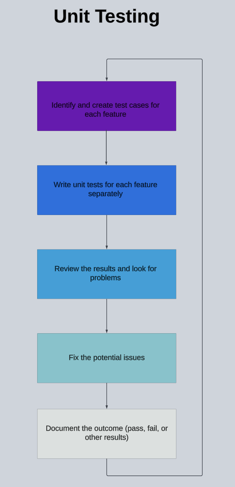

# <h1 align="center"> Test plan </h1>

---

 
Created by: Camille GAYAT   Creation Date: 09/27/2024   Last update: 10/17/2024

---

 

<b> Approvals <i>(Click to expand)</i></b>

### Approvals

| Reviewer          | Role              | Approved | Date       |
| ----------------- | ----------------- | -------- | ---------- |

<b>Table of contents <i>(Click to expand)</i></b>

- [Test plan](#test-plan)
- [Approvals](#approvals)
- [1. Introduction](#1-introduction)
    - [1.1 Overview](#11-overview)
    - [1.2 Objectives and Tasks](#12-objectives-and-tasks)
        - [1.2.1 Objectives](#121-objectives)
        - [1.2.2 Tasks](#122-tasks)
    - [1.3 Testing Scope](#13-testing-scope)
- [2. Test Tools](#2-test-tools)
    - [2.1 Software](#21-software)
    - [2.2 Hardware](#22-hardware)
        - [2.2.1 FPGA Board Specifications](#221-fpga-board-specifications)
        - [2.2.2 Hardware Test Environment](#222-hardware-test-environment)
    - [2.3 Version Control Tool](#23-version-control-tool)
    - [2.4 Simulation Tool](#24-simulation-tool)
    - [2.5 Synthesis Tool](#25-synthesis-tool)
- [3. Test Strategy](#3-test-strategy)
    - [3.1 Procedure](#31-procedure)
        - [3.1.1 Unit Testing](#311-unit-testing)
        - [3.1.2 Integration Testing](#312-integration-testing)
        - [3.1.3 Stress and Performance Testing](#313-stress-and-performance-testing)
        - [3.1.4 User Acceptance Testing](#314-user-acceptance-testing)
    - [3.2 Issue Tracking](#32-issue-tracking)
- [4. Test Cases](#4-test-cases)
- [5. Testing Standards](#5-testing-standards)
    - [5.1 Pass Criteria](#51-pass-criteria)
    - [5.2 Fail Criteria](#52-fail-criteria)
    - [5.3 Suspension Criteria](#53-suspension-criteria)
    - [5.4 Resumption Criteria](#54-resumption-criteria)
- [6. Risks and Contingencies](#6-risks-and-contingencies)
- [7. Appendix](#7-appendix)
- [8. Glossary](#8-glossary)

---

## 1. Introduction

---

### 1.1 Overview

The primary aim of this project is to develop a Frogger game inspired by the classic 1981 version created by Konami, using [FPGA](#8-glossary) technology and [Verilog](#8-glossary) for implementation. The main objective of the game is to guide four frogs safely across a busy road and a flowing river while avoiding various obstacles such as cars and logs. Players must navigate each frog to their home. For more specifications, refer to the [Functional Specification](Documents/Specification/Functional/FunctionalSpecification.md).

### 1.2 Objectives and Tasks

#### 1.2.1 Objectives

These are the objectives of the test plan:

- Verify the playability of the game on both macOS and Windows.
- Assess the user-friendliness of the game and the controls.
- Confirm that the functional requirements are met.
- Evaluate the performance of the game.

#### 1.2.2 Tasks

These are the tasks to ensure the quality of the game:

- Write test cases for all functionalities.
- Document and report each issue using issue tracking.
- Conduct Unit Testing for each features.
- Perform integration and system testing to evaluate how features work together.
- Perform User Acceptance testing to determine whether the game is user-friendly.
- Conduct Stress and Performance testing.

### 1.3 Testing Scope

The scope of testing for the Frogger game project includes the verification of both functional and non-functional requirements of the system, as well as an evaluation of its performance and user-friendliness.

## 2. Test Tools

---

Test tools refer to the various materials and instruments that will be employed throughout the testing process.

### 2.1 Software

For this project, we will use FPGA technology and Verilog due to the extensive possibilities it offers. Verilog provides greater flexibility in design, enabling direct control over hardware implementation while also optimizing resource usage. This combination ensures that we can achieve high performance and efficiency in our system design.

### 2.2 Hardware

#### 2.2.1 FPGA Board Specifications:

- Lattice ICE40 HX1K FPGA
- EASY USB Connection for power, communication, and programming
- Four User Settable LEDs
- Four Push-Buttons
- Dual 7-Segment LED Display
- VGA Connector
- External Connector (PMOD)
- 25 MHz on-board clock
- 1 Mb Flash for booting up your FPGA

#### 2.2.2 Hardware Test Environment:

##### MacBook Air M3 2024

| Specification | Details|
|:---------------:|:--------:|
| Operating system | macOS Sequoia 15.0 |
| Processor | Apple M3 GPU 10 cores|
| Memory | 16.0GB |
| Storage | 493.38GB SSD|
| Resolution | 2560x1664px |
| Display | Built-in Liquid Retina Display |

##### Lenovo Thinkbook 2021

| Specification | Details|
|:---------------:|:--------:|
| Operating system | Windows 11 Pro 21H2 |
| Processor | Intel(R) Core(TM) i7-1065G7 CPU @ 1.30GHz   1.50 GHz |
| Memory | 16.0GB |
| Storage | 476GB SSD |
| Resolution | 1080x1920px,  60Hz |

### 2.3 Version Control tool

GitHub is used in this project to facilitate seamless collaboration among team members, allowing for efficient version control, easy sharing of code, and streamlined communication, which ultimately enhances productivity and project management.

### 2.4 Simulation Tool

The project will use [EDA Playground](https://www.edaplayground.com) to [simulate](#8-glossary) and test the Verilog code. This platform was chosen due to several advantages that align well with our project’s needs:
- EDA Playground is web-based and don't require any installation
- The website offer a free access
- You can share your project to someone else
- The cross-platform compatibility
- No hardware is required to test the code

EDA Playground supports the use of [test benches](#8-glossary), which are essential for verifying the design. In this project, test benches will simulate the Frogger game mechanics, helping to identify and fix potential bugs early in the development process.

### 2.5 Synthesis Tool

For this project, APIO v0.9.4 will be utilized as the primary synthesis tool. It can be accessed through the Nandland website [here](https://nandland.com/set-up-apio-fpga-build-and-program/). APIO is specifically designed for FPGA development, providing a streamlined platform for transforming Verilog code into a hardware-compatible format.

## 3. Test Strategy

---

### 3.1 Procedure

*Responsible:* Does the work to complete the task.
*Accountable:* Delegates work and is the last one to review the task or deliverable before it's deemed complete.
*Consulted:* Provides input based on how it will impact their project work or their domain of expertise on the deliverable.
*Informed:* Needs to be kept in the loop on project progress, rather than roped into details of every deliverable.

| Role | RACI | Responsibilities |
|:------:|:------:|------------------|
| Project Manager | Informed | Approve the test results and have the final say. |
| Quality Assurance | Responsible | Write the test cases and execute the various tests. |
| Technical Lead | Consulted | Provide feedback. |
| Software Engineer | Accountable | Develop unit tests. |

#### 3.1.1 Unit Testing

Unit testing involves isolating each feature to test it individually, ensuring that everything works as expected by using test benches.

**Process:**

#### 3.1.2 Integration Testing

After unit tests, integration testing will be conducted. The goal of this testing is to evaluate all the features together using a test bench.

**Process:**

#### 3.1.3 Stress and Performance Testing

After integration testing, This is the turn of stress testing and performance testing. The purpose of stress testing is to determine how the FPGA board and the game will behave under extreme conditions. In contrast, performance testing aims to evaluate the speed, responsiveness, and stability of the FPGA board and the game under various conditions.

**Process:**

#### 3.1.4 User Acceptance Testing

Finally, the last test will be user acceptance testing. The goal is to allow a group of random people to play the game and provide feedback on its user-friendliness.

**Process:**

### 3.2 Issue Tracking

The goal of issue tracking, as the name suggests, is to monitor and document issues in both the code and project documents. These issues are then reported on [GitHub](https://github.com/algosup/2024-2025-project-1-fpga-team-5/issues), allowing the responsible team members to address and resolve them efficiently.

> :memo: There are three categories used to classify a problem based on its level of severity:

 
- This category is for issues that have minimal impact on the project or document and do not significantly affect its functionality. 
---

- This category is for issues that need to be fixed but do not severely disrupt the project or document, though they may cause minor inconveniences. 
---

- This category is for critical issues that need to be addressed as soon as possible because they either slow down the project significantly or completely halt its progress.

---

This template is used to report issues related to the code.

>**Code issue report template:**
>
>*Problem line:*
>
>*Problem name:* 
>
>*Reported By:* 
>
>*Date Reported:*
>
>*Defect level:*
>
>*Description:*
>
>*Problem reproducing:*
>
>*Expected Outcome:*
>
>*Assigned To:*
>
>*Comments:*

---

This template is used to report issues related to the documents.

> **Documents issue report template:**
>
>*Problem line:*
>
>*Problem name:*
>
>*Reported By:*
>
>*Date Reported:*
>
>*Defect level:*
>
>*Description:*
>
>*Assigned To:*
>
>*Comments:*

## 4. Test Cases

---

You can find the various Test Cases [here](https://docs.google.com/spreadsheets/d/19hOothj9DaywUXqyfjia2evk6Djy2kNbEhjEEK4RGDQ/edit?usp=sharing). The purpose of this document is to outline the future features that will need to be tested in advance to identify potential defects early in the project. The cases are presented in the following format:

- *Test Case:* A description of the scenario being tested.
- *Type:* Categorized as Audio/Visual, Game States/Dynamics, or Game Mechanics.
- *Status:* Indicates whether the test is Not Started, In Progress, or Done.
- *Test results:* Indicates whether the test has Failed or Passed.
- *Expected Result:* The anticipated outcome of the test.
- *Actual Result:* The observed outcome after testing.

## 5. Testing Standards

---

### 5.1 Pass Criteria

Pass criteria refer to the conditions required for a test to be considered successful.

- The game runs on both macOS and Windows.
- No defects are found.
- The feature works as expected according to the functional requirements.
- Memory usage is within acceptable limits.
- The user interface elements are displayed correctly.

### 5.2 Fail Criteria

Fail criteria refer to the conditions under which a test is considered failed.

- The game does not run on both macOS and Windows.
- Defects are found.
- The feature does not meet the functional requirements.
- Memory or hardware usage exceeds acceptable limits.
- The user interface elements are bugged or do not display as expected.
- Game logic is incorrect.

### 5.3 Suspension Criteria

Suspension criteria refer to the conditions under which testing needs to be stopped to resolve issues.

- A high-priority issue appears.
- Hardware components are defective.
- Failure to meet entry criteria at least three times.
- A change in the project scope occurs.
- Key members responsible for the tests are unavailable due to illness or other unforeseen reasons.

### 5.4 Resumption Criteria

Resumption criteria refer to the requirements needed to restart the testing phase after suspension. The testing process can be resumed when the issues that led to the suspension have been resolved.

## 6. Risks and Contingencies

---

| Risk | Risk level | Contingency |
|:------:|:------------:|------------|
| Hardware malfunction |  | Conduct regular inspections of the hardware equipment. If there is a problem, report it to the project manager and replace the board. |
| Insufficient resources |  | Optimize the code to utilize less resources, prioritizing the most important features first. |
| Project scope creep |  | Identify and clarify the needs and scope to mitigate this risk. |

## 7. Appendix

---

## 8. Glossary

---

| Term | Definition |
|:------:|------------|
| FPGA | FPGA (Field-Programmable Gate Array) is a type of semiconductor device that can be programmed or configured by the user after manufacturing. |
| Verilog | Verilog is a hardware description language (HDL) used to model and simulate digital systems and circuits, enabling designers to describe the structure and behavior of electronic components. |
| Simulate | Simulate means to create a model or representation of a system or process to analyze its behavior under various conditions, often using software to replicate real-world scenarios. |
| Test bench | Test bench is a simulated environment used to verify the functionality of a hardware design by providing inputs, monitoring outputs, and checking behavior against expected results. |
| Unit testing | Unit Testing is a software testing method that involves testing individual components or functions of a program in isolation to ensure they work correctly. |
| Integration testing | Integration Testing is a testing process that evaluates the interaction and compatibility between combined software components or systems to ensure they work together as intended. |
| Stress testing | Stress Testing is a testing technique that evaluates a system's performance under extreme conditions or loads to identify its breaking points and ensure stability and reliability. |
| Performance testing | Performance Testing is a testing method used to evaluate the speed, responsiveness, and stability of a system under a particular workload to ensure it meets performance requirements. |
| User Acceptance testing | User Acceptance Testing (UAT) is the final phase of software testing where end-users validate that the system meets their needs and requirements before it goes live. |