<!-- PROJECT LOGO -->
 

  <h1 align="center">Functional Specification</h1>
  

    <strong>Frogger in FPGA - Team 5's project</strong>
     
  
  

 

**Written by:** [***Rémy CHARLES***](https://github.com/RemyCHARLES)  
**Created on:** *2024-09-23*  
**Last updated:** *2024-10-01*

<!-- TABLE OF CONTENTS -->

### Table of Contents

- [I. Introduction](#i-introduction)
  - [1. Glossary](#1-glossary)
  - [2. Project Overview](#2-project-overview)
    - [Project Definition](#project-definition)
      - [Vision](#vision)
      - [Objectives](#objectives)
      - [Scope](#scope)
      - [Target Audience](#target-audience)
      - [Deliverables](#deliverables)
  - [4. Project Layout](#4-project-layout)
    - [Project Team](#project-team)
    - [Stakeholders](#stakeholders)
    - [Team Roles](#team-roles)
- [II. Game Design](#ii-game-design)
  - [1. Game Concept](#1-game-concept)
    - [Storyline and Theme](#storyline-and-theme)
    - [Game Objectives](#game-objectives)
    - [Player Goals](#player-goals)
  - [2. Gameplay Mechanics](#2-gameplay-mechanics)
    - [Game Rules](#game-rules)
    - [Levels and Challenges](#levels-and-challenges)
    - [Scoring System](#scoring-system)
  - [3. User Interface Design](#3-user-interface-design)
    - [Sprites and Graphics](#sprites-and-graphics)
      - [**Frogger**](#frogger)
      - [**Death**](#death)
      - [**Cars**](#cars)
      - [**Trucks**](#trucks)
      - [**Logs**](#logs)
      - [**Turtles**](#turtles)
      - [**Background**](#background)
    - [Screen Layouts](#screen-layouts)
      - [**Main Menu**](#main-menu)
      - [**Game Screen**](#game-screen)
      - [**Game Over Screen**](#game-over-screen)
    - [Controls and Inputs](#controls-and-inputs)
    - [Feedback Mechanisms](#feedback-mechanisms)
  - [4. Visual Elements](#4-visual-elements)
    - [Color Palette](#color-palette)
    - [Animations](#animations)
- [III. User Experience](#iii-user-experience)

[III. **User Experience**](#iii-user-experience)
   1. [➣ Accessibility Features](#1-accessibility-features)
      - [Assistive Technologies](#assistive-technologies)
      - [Accessibility Standards](#accessibility-standards)
   2. [➣ User Engagement Strategies](#2-user-engagement-strategies)
      - [In-game Rewards](#in-game-rewards)
      - [User Progress Tracking](#user-progress-tracking)
   3. [➣ Adaptability to User Feedback](#3-adaptability-to-user-feedback)
      - [Feedback Channels](#feedback-channels)
      - [Iterative Design Updates](#iterative-design-updates)
   4. [➣ Device Compatibility](#4-device-compatibility)
      - [Supported Devices](#supported-devices)
      - [Cross-Platform Compatibility](#cross-platform-compatibility)
  
[IV. **Non-Functional Requirements**](#iv-non-functional-requirements)
   1. [➣ Performance](#1-performance)
      - [Responsiveness](#responsiveness)
      - [Resource Utilization](#resource-utilization)

[VI. **Future Enhancements**](#vi-future-enhancements)
   1. [➣ Feature Roadmap](#1-feature-roadmap)
   2. [➣ Potential Expansions](#2-potential-expansions)

[VII. **References**](#vii-references)

[VIII. **Revision History**](#viii-revision-history)

# I. Introduction

## 1. Glossary

| Term | Definition |
| --- | --- |
| Frogger | Frogger is a classic arcade game developed by Konami and released in 1981. The game involves guiding a frog across a busy road and river, avoiding obstacles and hazards along the way. |
| FPGA | Field-Programmable Gate Array `Definition still in progress...`|
| HDL | Hardware Description Language `Definition still in progress...`|
| Verilog | Verilog is a HDL used to model electronic systems. It is commonly used in the design and verification of digital circuits. |
| VGA | Video Graphics Array `Definition still in progress...`|

## 2. Project Overview

This project aims to recreate the classic arcade game **Frogger** on an FPGA platform. 

### Project Definition

#### Vision

The vision of this project is to provide an interactive and engaging gaming experience that pays homage to the classic arcade game Frogger. By leveraging the capabilities of FPGA technology, we aim to create a faithful recreation of the original game with enhanced graphics and gameplay features.

This game will be designed to appeal to both nostalgic players who remember the original Frogger and new players who are looking for a fun and challenging gaming experience.

#### Objectives

   - **Technology**: Implement the game logic and graphics using Verilog HDL on an FPGA platform.
   - **Gameplay**: Recreate the classic Frogger gameplay with enhanced graphics and additional features.

#### Scope

This project will be developped on a "[Go-Board](https://nandland.com/the-go-board/)" FPGA platform. Using Verilog HDL, we will implement the game logic, graphics, and user interface elements required to recreate the classic Frogger game.

#### Target Audience

The target audience for this project includes:
   - Fans of classic arcade games who are familiar with the original Frogger.
   - Players looking for a challenging and engaging gaming experience.
   - Students and hobbyists interested in FPGA development and game design.

#### Deliverables

The main deliverables is the source code of the game, supported by multiple version of this game and mockups of the design.

Other deliverables include:
   - Functional Specification Document
   - Technical Specification Document
   - User Manual
   - Test Plan and Test Cases
   - Management Plan & Weekly reports

## 4. Project Layout

### Project Team

| Name | Role | Contact (*Click*) |
| --- | --- | --- |
| Alexis LASSELIN | Project Manager |   |
| Rémy CHARLES | Program Manager |   |
| Michel RIFF | Tech Lead |   |
| Mathias GAGNEPAIN | Software Engineer |   |
| Séréna BAVAROIS | Software Engineer |   |
| Camille GAYAT | Quality Assurance |   |
| Salaheddine NAMIR | Technical Writer |   |

### Stakeholders

| Name | Role |
| --- | --- |
| Franck JEANNIN ([**ALGOSUP**](https://algosup.com/)) | School Director |

### Team Roles

| Role | Description |
| :--- | :--- |
| Project Manager | Responsible for overall project planning, coordination, and communication. |
| Program Manager | Responsible of deadlines and deliverables. Design of the project of his directive. Should deliver the functional specification |
| Tech Lead | Responsible for technical design and implementation of the project. |
| Software Engineer | Responsible for developing and testing the game logic and graphics. |
| Quality Assurance | Responsible for testing the game and ensuring that it meets the specified requirements. |
| Technical Writer | Responsible for documenting the project and creating user manuals. |

# II. Game Design

## 1. Game Concept

### Storyline and Theme

**Storyline**

Frogger is a frog aiming to return home safely after a day’s wandering. The journey home is fraught with dangers: busy highways and treacherous rivers filled with obstacles. Help Frogger navigate these perils to reach the safety of his lily pad on the other side of the road and river.

**Theme**

The theme of “Frogger: The Classic Leap” centers on the quest for safety and the inherent dangers of an everyday journey in a perilous environment. This theme embodies the universal struggle against obstacles, both in the natural world and human-created challenges, reflecting on the risk and vigilance needed in daily survival.

### Game Objectives

The main objective of the game is to guide Frogger safely across the road and river to reach his lily pad home. For that, the player must:
   - Avoid getting hit by cars on the road.
   - Cross the river by jumping on logs and avoiding sinking into the water.
   - Reach the lily pad on the other side of the river to complete the level.

### Player Goals

The player’s goal is to successfully guide Frogger across the road and river to reach the lily pad home. The player must navigate through multiple levels, each with increasing difficulty and obstacles, to complete the game.

## 2. Gameplay Mechanics

### Game Rules

**Player Movement**

  - **Controls**: Players use directional inputs to move Frogger up, down, left, and right across the screen. The goal is to navigate from the bottom of the screen to the safe zones located at the top.
  - **Movement dynamics**: Each press of a control results in Frogger hopping one grid space in the chosen direction. The frog cannot move diagonally and cannot move outside the boundaries of the game screen.

### Levels and Challenges

**Level Progression**

  - **Multiple levels**: The game consists of multiple levels, each with a different layout of obstacles and challenges.
  - **Increasing difficulty**: Each level increases in difficulty, with faster-moving cars, more obstacles in the river, and other challenges to overcome.

**Challenges**

  - **Road hazards**: Cars and trucks move across the road at varying speeds. Frogger must avoid getting hit by these vehicles to stay alive.
  - **River obstacles**: Logs and turtles move across the river, providing platforms for Frogger to jump on. Frogger must avoid falling into the water to survive.

### Scoring System

**Scoring Mechanism**

  - **Reaching a Home**: Each time Frogger successfully reaches a home, players score points. Bonus points are awarded for reaching a home with a female frog or a fly present.
  - **Time Bonus**: Players receive additional points based on the amount of time left on the timer after reaching a home.
  - **Progression**: Completing all homes resets the level with increased difficulty, including faster-moving vehicles and more erratic river obstacles.

## 3. User Interface Design

### Sprites and Graphics

#### **Frogger**

*Static Frogger*

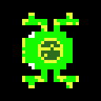

By default, Frogger is displayed in a static position facing up, down, left, or right.

*Jumping Frogger*

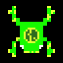

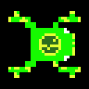

When Frogger moves in a direction, an animation shows the frog jumping in that direction.

#### **Death**

When Frogger collides with a vehicle or falls into the water, a death animation is displayed.

#### **Cars**

*Red Cars*

*Blue Cars*

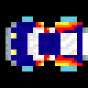

*Racing Cars*

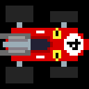

Different types of cars move across the road at varying speeds.

#### **Trucks**

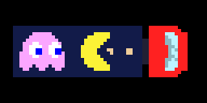

Trucks move across the road at a slower speed than cars.

#### **Logs**

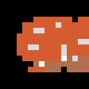

Logs move across the river, providing platforms for Frogger to jump on.

#### **Turtles**

*Swimming Turtles*

Allowing Frogger to jump on them, turtles move across the river.

*Submerged Turtles*

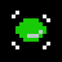
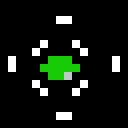

When submerged, turtles do not provide a platform for Frogger to jump on.

**Homes**

 Lily pad homes at the top of the screen where Frogger must reach.

#### **Background**

*Spawn Land*

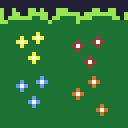

*Road*

*Middle Land*

*River*

*Homes Area*

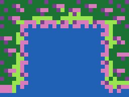 

*Homes Interval*

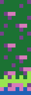

### Screen Layouts

#### **Main Menu**

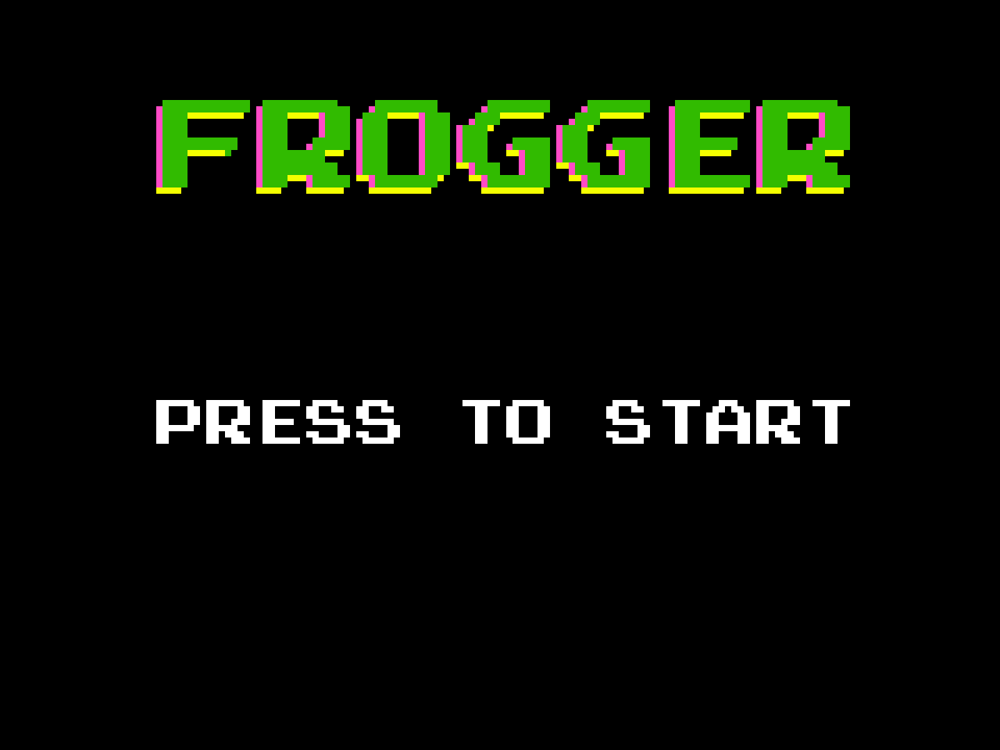

  - **Title**: The game title is displayed prominently at the top of the screen.
  - **Start Button**: Players can start the game by clicking on a button.

#### **Game Screen**

   - **Frogger**: The player’s frog character is displayed at the bottom of the screen.
   - **Road**: The road with moving vehicles is located in the middle of the screen.
   - **River**: The river with moving logs and turtles is located at the top of the screen.
   - **Homes**: The lily pad homes are located at the top of the screen, where Frogger must reach to complete the level.
   - **Score**: The player’s current score is displayed at the top of the screen.
   - **Timer**: A timer counts down the remaining time for the player to complete the level.

#### **Game Over Screen**

   - **Game Over Message**: A message is displayed to inform the player that the game is over.
   - **Final Score**: The player’s final score is displayed on the screen.
   - **Restart Button**: Players can restart the game by clicking on a button.

### Controls and Inputs

**Controls**

   - **Up ↑**: Move Frogger up one grid space.
   - **Down ↓**: Move Frogger down one grid space.
   - **Left ←**: Move Frogger left one grid space.
   - **Right →**: Move Frogger right one grid space.

### Feedback Mechanisms

**Visual Feedback**

   - **Movement**: Frogger hops in the direction chosen by the player, providing visual feedback on the player’s input.
   - **Collision**: When Frogger collides with a vehicle or falls into the water, a visual indicator shows the collision.

## 4. Visual Elements

### Color Palette

<b>Frogger Colors</b>

   -  `#16fa00 `
   -  `#e4ff34 `
   -  `#2c6d1e `
   -  `#ffffff `
   -  `#000000 `

<b>Death Colors</b>

   -  `#822fa1 `
   -  `#fbf236 `
   -  `#d51c1c `

<b>Red Cars Colors</b>

   -  `#ff0404 `
   -  `#e00000 `
   -  `#fffcb5 `
   -  `#fbf236 `
   -  `#ff8704 `
   -  `#ffffff `
   -  `#e5e5e5 `
   -  `#5fcde4 `
   -  `#6abacb `
   -  `#9badb7 `
   -  `#85949c `

<b>Blue Cars Colors</b>

   -  `#0f0092 `
   -  `#000078 `
   -  `#fffcb5 `
   -  `#fbf236 `
   -  `#ff8704 `
   -  `#ffffff `
   -  `#e5e5e5 `
   -  `#5fcde4 `
   -  `#6abacb `
   -  `#9badb7 `
   -  `#85949c `

<b>Racing Cars Colors</b>

   -  `#db0000 `
   -  `#a70000 `
   -  `#ffffff `
   -  `#fbf236 `
   -  `#9badb7 `
   -  `#242424 `
   -  `#222034 `
   -  `#847e87 `
   -  `#9c9c9c `
   -  `#696a6a `

<b>Trucks Colors</b>

   -  `#121b49 `
   -  `#ff2121 `
   -  `#fbf236 `
   -  `#eecd9a `
   -  `#0000ff `
   -  `#ffffff `
   -  `#222034 `
   -  `#8cb7c1 `
   -  `#bcf3ff `
   
   Moving to the left:  `#ff0000 ` 

   Moving to the right:  `#fba6ff `

  

<b>Logs Colors</b>

   -  `#d55c31 `
   -  `#b16f4f `
   -  `#dbdbdb `

<b>Turtles Colors</b>

   -  `#ff0b0 `
   -  `#31ff1e `
   -  `#ffffff `

<b>Homes Colors</b>

   -  `#249c44 `
   -  `#99e550 `

<b>Spawn Land Colors</b>
  

   -  `#222034 `
   -  `#1c7233 `
   -  `#99e550 `
   -  `#fbf236 `
   -  `#ac3232 `
   -  `#639bff `
   -  `#df7126 `
   -  `#ffffff `

<b>Road Colors</b>

   -  `#3c3858 `
   -  `#d5d5d5 `
   -  `#ffffff `

<b>Middle Land Colors</b>

   -  `#222034 `
   -  `#1c7233 `
   -  `#99e550 `
   -  `#2061b6 `

<b>River Colors</b>

   -  `#2061b6 `
   -  `#2777e0 `

<b>Homes Area Colors</b>

   -  `#2061b6 `
   -  `#d77bba `
   -  `#76428a `
   -  `#99e550 `
   -  `#1c7233 `

### Animations

**Animated Sprites**

*Swimming Turtles Animation*

*Submerged Turtles Animation*

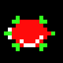

*Jumping Frogger Animation*

*Death Animation*

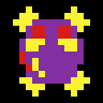

# III. User Experience

