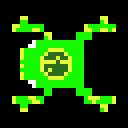
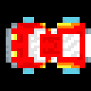
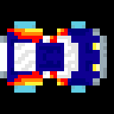
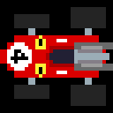
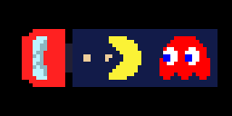
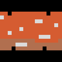
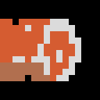
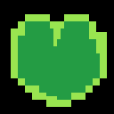
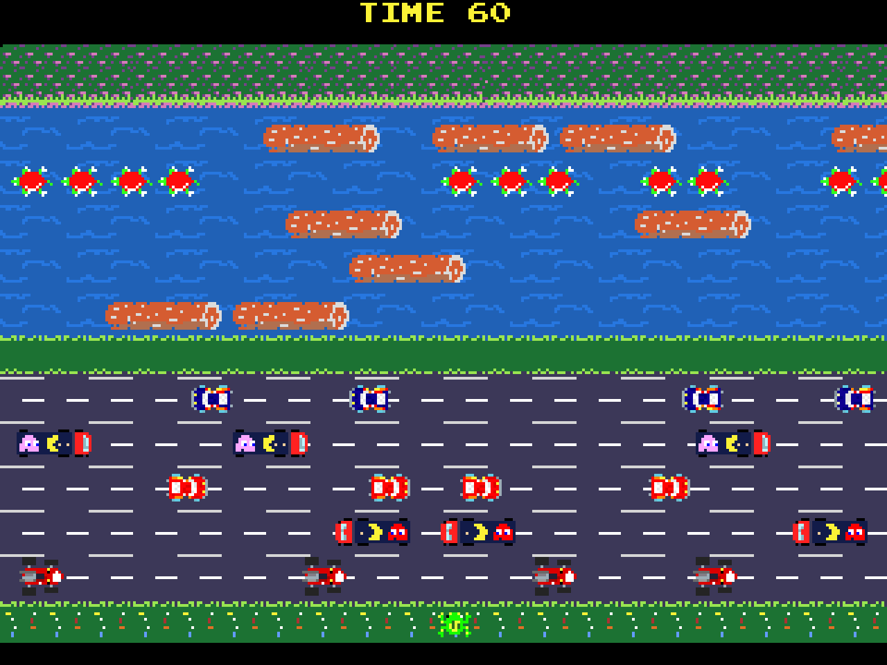
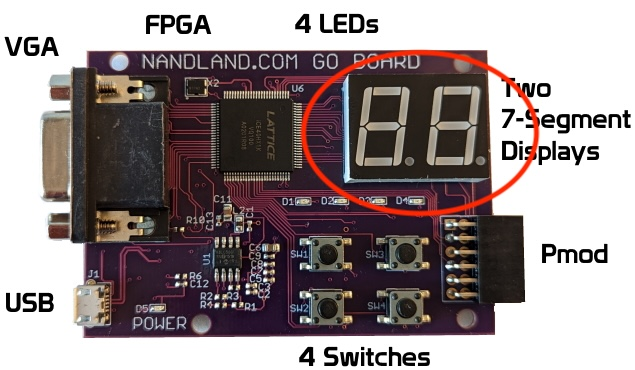

<!-- PROJECT LOGO -->
 

  <h1 align="center">Functional Specification</h1>
  

    <strong>Frogger in FPGA - Team 5's project</strong>
     
  

 

**Written by:** [*Rémy CHARLES*](https://github.com/RemyCHARLES)

**Created on:** *2024-09-23* 

**Last updated:** *2024-10-04*

**Reviewed by:** *None*

<!-- TABLE OF CONTENTS -->

### Table of Contents

- [I. Introduction](#i-introduction)
  - [1.1 Glossary](#11-glossary)
  - [1.2 Project Overview](#12-project-overview)
    - [1.2.1 Project Definition](#121-project-definition)
    - [1.2.2 Vision](#122-vision)
    - [1.2.3 Objectives](#123-objectives)
    - [1.2.4 Scope](#124-scope)
    - [1.2.5 Target Audience](#125-target-audience)
    - [1.2.6 User Personas](#126-user-personas)
    - [1.2.7 Deliverables](#127-deliverables)
  - [1.3. Project Layout](#13-project-layout)
    - [1.3.1 Project Team](#131-project-team)
    - [1.3.2 Stakeholders](#132-stakeholders)
    - [1.3.3 Team Roles](#133-team-roles)
- [II. Game Design](#ii-game-design)
  - [2.1 Game Concept](#21-game-concept)
    - [2.1.1 Storyline and Theme](#211-storyline-and-theme)
    - [Game Objectives](#game-objectives)
    - [Player Goals](#player-goals)
    - [2.1.2 Gameplay Mechanics](#212-gameplay-mechanics)
      - [Levels and Challenges](#levels-and-challenges)
      - [Scoring System](#scoring-system)
  - [2.2 Level Design](#22-level-design)
    - [2.2.1 Level Layout](#221-level-layout)
    - [2.2.2 Level Progression](#222-level-progression)
    - [2.2.3 Game Over Conditions](#223-game-over-conditions)
    - [2.2.4 Win Conditions](#224-win-conditions)
  - [2.3 User Interface Design](#23-user-interface-design)
    - [2.3.1 Sprites and Graphics](#231-sprites-and-graphics)
    - [2.3.2 Screen Layouts](#232-screen-layouts)
    - [2.3.3 Controls and Inputs](#233-controls-and-inputs)
    - [2.3.4 Feedback Mechanisms](#234-feedback-mechanisms)
  - [2.4 Visual Elements](#24-visual-elements)
    - [2.4.1 Color Palette](#241-color-palette)
    - [2.4.2 Animations](#242-animations)
- [III. Non-Functional Requirements](#iii-non-functional-requirements)
  - [3.1 Performance](#31-performance)
    - [3.1.1 Responsiveness](#311-responsiveness)
      - [Input Lag](#input-lag)
      - [Frame Rate](#frame-rate)
    - [3.1.2 Resource Utilization](#312-resource-utilization)
      - [Resource Efficiency](#resource-efficiency)
      - [Power Consumption](#power-consumption)
  - [3.2 Technical Requirements](#32-technical-requirements)
    - [3.2.1 Technical Specifications](#321-technical-specifications)
      - [System Inputs and Outputs](#system-inputs-and-outputs)
    - [3.2.2 Input/Output Handling](#322-inputoutput-handling)
    - [3.2.3 Constraints Limitations](#323-constraints-limitations)
  - [3.3 System Architecture](#33-system-architecture)
    - [3.3.1 Block Diagram](#331-block-diagram)
- [IV. Development Plan](#iv-development-plan)
  - [4.1 Phases and Milestones](#41-phases-and-milestones)
  - [4.2 Timeline](#42-timeline)
  - [4.3 Budget](#43-budget)
- [V. Risk Management](#v-risk-management)
  - [5.1 Risk Identification](#51-risk-identification)
    - [5.1.1 Technical Risks](#511-technical-risks)
    - [5.1.2 Schedule Risks](#512-schedule-risks)
    - [5.1.3 Resource Risks](#513-resource-risks)
  - [5.2 Risk Mitigation](#52-risk-mitigation)
    - [5.2.1 Technical Risks](#521-technical-risks)
    - [5.2.2 Schedule Risks](#522-schedule-risks)
    - [5.2.3 Resource Risks](#523-resource-risks)
  - [5.3 Risk Contingency](#53-risk-contingency)
    - [5.3.1 Technical Risks](#531-technical-risks)
    - [5.3.2 Schedule Risks](#532-schedule-risks)
    - [5.3.3 Resource Risks](#533-resource-risks)
- [V. Compliance and Standards](#v-compliance-and-standards)
- [VI. Future Enhancements](#vi-future-enhancements)
  - [1. Feature Roadmap](#1-feature-roadmap)
    - [Additional Levels](#additional-levels)
    - [Power-Ups and Abilities](#power-ups-and-abilities)
    - [Customization Options](#customization-options)
- [VII. Conclusion](#vii-conclusion)

# I. Introduction

## 1.1 Glossary

| Term | Definition |
| --- | --- |
| **Frogger** | Frogger is a classic arcade game developed by Konami and released in 1981. The game involves guiding a frog across a busy road and river, avoiding obstacles and hazards along the way. |
| **FPGA (Field-Programmable Gate Array)** | A semiconductor device that can be configured after manufacturing by a customer or a designer using specialized software and a hardware description language (HDL). It is made up of a matrix of configurable logic blocks (CLBs) connected via programmable interconnects.|
| **HDL (Hardware Description Language)** |  A specialized computer language used to describe the structure and behavior of electronic circuits, and commonly used in the design and development of digital logic in FPGAs. |
| **Verilog** | A hardware description language (HDL) used to model electronic systems. It is most commonly used in the design and verification of digital circuits at the register-transfer level (RTL) of abstraction. |
| **VGA (Video Graphics Array)** | A standard for video display controller first introduced with the IBM PS/2 line of computers in 1987. It is widely used for displaying graphics on computer monitors and other display devices. |
| **Sprite** | A two-dimensional image or animation that is integrated into a larger scene or game. Sprites are commonly used in video games to represent characters, objects, and other elements of the game world. |
| **Frame Rate** | The rate at which consecutive images (frames) are displayed in a video game or animation. A higher frame rate results in smoother motion and more fluid animations. |
| **Input Lag** | The delay between the player inputting a command and the game responding to that input. Input lag can affect the responsiveness and playability of a game. |

## 1.2 Project Overview

This project aims to recreate the classic arcade game "**Frogger**" on an FPGA platform. 

### 1.2.1 Project Definition

### 1.2.2 Vision

The vision of this project is to provide an interactive and engaging gaming experience that pays homage to the classic arcade game Frogger. By leveraging the capabilities of FPGA technology, we aim to create a faithful recreation of the original game with enhanced graphics.

This game will be designed to appeal to both nostalgic players who remember the original Frogger and new players who are looking for a remastered version of a classic game.
### 1.2.3 Objectives

   - **Technology**: Implement the game logic and graphics using **Verilog HDL** on an FPGA platform.
   - **Gameplay**: Recreate the classic Frogger gameplay with enhanced graphics.

### 1.2.4 Scope

This project will be developped on a "[Go-Board](https://nandland.com/the-go-board/)" FPGA platform. Using Verilog HDL, we will implement the game logic, graphics, and user interface elements required to recreate the classic Frogger game.

### 1.2.5 Target Audience

The target audience for this game includes players who enjoy classic arcade games, retro gaming enthusiasts, and fans of the original Frogger game. The game is designed to appeal to a wide range of players, from casual gamers looking for a fun and challenging experience to hardcore gamers seeking to test their skills and reflexes.

### 1.2.6 User Personas

<strong>Sam, the Retro Gamer</strong>

- **Age**: 35
- **Occupation**: Web Developer
- **Gaming Preferences**: Prefers nostalgic, retro-style video games from the 80s and 90s.
- **Goals**: To relive childhood gaming experiences through a modern rendition of classic games.
- **Challenges**: Often disappointed by modern games that fail to capture the essence of retro gameplay.
- **Motivations**: Seeks games that offer a genuine retro feel with updated performance and graphics.
- **Tech Savviness**: High—familiar with both classic and current gaming platforms.
- **Gameplay Expectations**: Prefers simple, intuitive controls and pixelated graphics reminiscent of early gaming consoles.

<strong>Jordan, the Competitive Player</strong>

- **Age**: 28
- **Occupation**: Financial Analyst
- **Gaming Preferences**: Favors games that require quick reflexes, strategic thinking, and feature competitive leaderboards.
- **Goals**: To master each level and top the global leaderboards.
- **Challenges**: Experiences frustration with games that have unpredictable controls or poor response times.
- **Motivations**: Driven by a competitive spirit to excel and achieve recognition in the gaming community.
- **Tech Savviness**: Moderate—primarily interested in gaming performance, not the underlying technology.
- **Gameplay Expectations**: Expects smooth, responsive gameplay and well-designed levels that challenge skills.

<strong>Casey, the Casual Gamer</strong>

- **Age**: 24
- **Occupation**: Graduate Student
- **Gaming Preferences**: Looks for fun, stress-relieving games that are easy to pick up and play in short bursts.
- **Goals**: To find games that are entertaining and relaxing, without a steep learning curve.
- **Challenges**: Has limited time for gaming due to a busy schedule.
- **Motivations**: To unwind and have fun without the commitment required by more complex games.
- **Tech Savviness**: Low—more interested in the game's content than its technical aspects.
- **Gameplay Expectations**: Prefers games with simple mechanics, straightforward objectives, and the ability to save progress easily.

### 1.2.7 Deliverables

The main deliverables is the source code of the game, supported by multiple version of this game and mockups of the design.

Other deliverables include:
   - Functional Specification Document
   - Technical Specification Document
   - User Manual
   - Test Plan and Test Cases
   - Management Plan & Weekly reports

## 1.3. Project Layout

### 1.3.1 Project Team

| Name | Role | Contact (*Click*) |
| --- | --- | --- |
| Alexis LASSELIN | Project Manager |   |
| Rémy CHARLES | Program Manager |   |
| Michel RIFF | Tech Lead |   |
| Mathias GAGNEPAIN | Software Engineer |   |
| Séréna BAVAROIS | Software Engineer |   |
| Camille GAYAT | Quality Assurance |   |
| Salaheddine NAMIR | Technical Writer |   |

### 1.3.2 Stakeholders

| Name | Role |
| --- | --- |
| Franck JEANNIN ([**ALGOSUP**](https://algosup.com/)) | School Director |

### 1.3.3 Team Roles

| Role | Description |
| :--- | :--- |
| Project Manager | Responsible for overall project planning, coordination, and communication. |
| Program Manager | Responsible of deadlines and deliverables. Design of the project of his directive. Should deliver the functional specification |
| Tech Lead | Responsible for technical design and implementation of the project. |
| Software Engineer | Responsible for developing and testing the game logic and graphics. |
| Quality Assurance | Responsible for testing the game and ensuring that it meets the specified requirements. |
| Technical Writer | Responsible for documenting the project and creating user manuals. |

# II. Game Design

## 2.1 Game Concept

### 2.1.1 Storyline and Theme

**Storyline**

Frogger is a frog aiming to return home safely after a day’s wandering. The journey home is fraught with dangers: busy highways and treacherous rivers filled with obstacles. Help Frogger navigate these perils to reach the safety of his lily pad on the other side of the road and river.

**Theme**

The theme of "*Frogger*” centers on the quest for safety and the inherent dangers of an everyday journey in a perilous environment. This theme embodies the universal struggle against obstacles, both in the natural world and human-created challenges, reflecting on the risk and vigilance needed in daily survival.

### Game Objectives

The main objective of the game is to guide Frogger safely across the road and river to reach his lily pad home. For that, the player must:
   - Avoid getting hit by cars on the road.
   - Cross the river by jumping on logs and avoiding sinking into the water.
   - Reach the lily pad on the other side of the river 5 times to complete the level.

### Player Goals

The player’s goal is to successfully guide Frogger across the road and river to reach the lily pad home. The player must navigate through multiple levels, each with increasing difficulty and obstacles, to complete the game.

### 2.1.2 Gameplay Mechanics

**Player Movement**

  - **Controls**: Players use directional inputs to move Frogger up, down, left, and right across the screen. The goal is to navigate from the bottom of the screen to the safe zones located at the top.
  - **Movement dynamics**: Each press of a control results in Frogger hopping one grid space in the chosen direction. The frog cannot move diagonally and cannot move outside the boundaries of the game screen.

#### Levels and Challenges

**Level Progression**

  - **Multiple levels**: The game consists of multiple levels, each with a different layout of obstacles and challenges.
  - **Increasing difficulty**: Each level increases in difficulty, with faster-moving cars, more obstacles in the river, and other challenges to overcome.

**Challenges**

  - **Road hazards**: Cars and trucks move across the road at varying speeds. Frogger must avoid getting hit by these vehicles to stay alive.
  - **River obstacles**: Logs and turtles move across the river, providing platforms for Frogger to jump on. Frogger must avoid falling into the water to survive.

#### Scoring System

**Scoring Mechanism**

  - **Reaching a Home**: Each time Frogger successfully reaches a home, players score points. The score increases with each home reached.
  - **Time Bonus**: Players receive additional points based on the amount of time left on the timer after reaching a home.
  - **Progression**: Completing all homes resets the level with increased difficulty, including faster-moving vehicles and more erratic river obstacles.

## 2.2 Level Design

### 2.2.1 Level Layout

**Road**

   - **Cars**: Red cars move from left to right, blue cars move from right to left, and racing cars move in both directions at high speeds.
   - **Trucks**: Trucks move across the road at a slower speed than cars.

**River**

   - **Logs**: Logs move across the river at varying speeds, providing platforms for Frogger to jump on.
   - **Turtles**: Turtles move across the river, allowing Frogger to jump on them. Some turtles submerge underwater, making them unsafe to jump on.

**Homes**

   - **Lily Pads**: The lily pad homes are located at the top of the screen, where Frogger must reach to complete the level.

### 2.2.2 Level Progression

**Difficulty Curve**

   - **Increasing Difficulty**: Each level increases in difficulty, with faster-moving vehicles, more obstacles in the river, and other challenges to overcome.
   - **Progression**: Completing all homes resets the level with increased difficulty, including faster-moving vehicles and more erratic river obstacles.

### 2.2.3 Game Over Conditions

**Death**

   - **Collision**: If Frogger collides with a vehicle on the road or falls into the water, the player loses a life.
   - **Lives**: Players have 5 lives to complete the game. Running out of lives results in a game over.

### 2.2.4 Win Conditions

**Victory**

   - **Completing Levels**: Players must guide Frogger safely across the road and river to reach all the lily pad homes and complete the level.
   - **Progression**: Completing all levels in the game results in victory.

## 2.3 User Interface Design

### 2.3.1 Sprites and Graphics

**Frogger**

*Static Frogger*

By default, Frogger is displayed in a static position facing up, down, left, or right.

*Jumping Frogger*

When Frogger moves in a direction, an animation shows the frog jumping in that direction.

**Death**

When Frogger collides with a vehicle or falls into the water, a death animation is displayed.

**Lives**

The number of lives remaining is displayed at the top of the screen.

**Frogger on Homes**

When Frogger reaches a home, the frog is displayed on the lily pad.

**Cars**

*Red Cars*

*Blue Cars*

*Racing Cars*

Different types of cars move across the road at varying speeds.

**Trucks**

Trucks move across the road at a slower speed than cars.

**Logs**

Logs move across the river, providing platforms for Frogger to jump on.

**Turtles**

*Swimming Turtles*

Allowing Frogger to jump on them, turtles move across the river.

*Submerged Turtles*

When submerged, turtles do not provide a platform for Frogger to jump on.

**Homes**

 Lily pad homes at the top of the screen where Frogger must reach.

**Background**

*Spawn Land*

*Road*

*Middle Land*

*River*

*Homes Area*

 

*Homes Interval*

### 2.3.2 Screen Layouts

**Main Menu**

  - **Title**: The game title is displayed prominently at the top of the screen.
  - **Start Button**: Players can start the game by clicking on a button.

**Game Screen**

   - **Frogger**: The player’s frog character is displayed at the bottom of the screen.
   - **Road**: The road with moving vehicles is located in the middle of the screen.
   - **River**: The river with moving logs and turtles is located at the top of the screen.
   - **Homes**: The lily pad homes are located at the top of the screen, where Frogger must reach to complete the level.
   - **Score**: The player’s current score is displayed at the top of the screen.
   - **Timer**: A timer counts down the remaining time for the player to complete the level.
   - **Lives**: The number of lives remaining is displayed at the top of the screen.

**Game Over Screen**

   - **Game Over Message**: A message is displayed to inform the player that the game is over.
   - **Final Score**: The player’s final score is displayed on the screen.
   - **Restart Button**: Players can restart the game by clicking on a button.

### 2.3.3 Controls and Inputs

**Controls**

   - **Up ↑**: Move Frogger up one grid space.
   - **Down ↓**: Move Frogger down one grid space.
   - **Left ←**: Move Frogger left one grid space.
   - **Right →**: Move Frogger right one grid space.

### 2.3.4 Feedback Mechanisms

**Visual Feedback**

   - **Movement**: Frogger hops in the direction chosen by the player, providing visual feedback on the player’s input.
   - **Collision**: When Frogger collides with a vehicle or falls into the water, a visual indicator shows the collision.

## 2.4 Visual Elements

### 2.4.1 Color Palette

<b>Frogger Colors</b>

   -  `#16fa00 `
   -  `#e4ff34 `
   -  `#2c6d1e `
   -  `#ffffff `
   -  `#000000 `

<b>Death Colors</b>

   -  `#822fa1 `
   -  `#fbf236 `
   -  `#d51c1c `

<b>Lives Colors</b>

   -  `#fbf236 `
   -  `#75ef00 `
   -  `#ff00af `

<b>Frogger on Homes Colors</b>

   -  `#70e500 `
   -  `#fbf236 `
   -  `#428700 `
   -  `#ff8500 `
   -  `#000000 `

<b>Red Cars Colors</b>

   -  `#ff0404 `
   -  `#e00000 `
   -  `#fffcb5 `
   -  `#fbf236 `
   -  `#ff8704 `
   -  `#ffffff `
   -  `#e5e5e5 `
   -  `#5fcde4 `
   -  `#6abacb `
   -  `#9badb7 `
   -  `#85949c `

<b>Blue Cars Colors</b>

   -  `#0f0092 `
   -  `#000078 `
   -  `#fffcb5 `
   -  `#fbf236 `
   -  `#ff8704 `
   -  `#ffffff `
   -  `#e5e5e5 `
   -  `#5fcde4 `
   -  `#6abacb `
   -  `#9badb7 `
   -  `#85949c `

<b>Racing Cars Colors</b>

   -  `#db0000 `
   -  `#a70000 `
   -  `#ffffff `
   -  `#fbf236 `
   -  `#9badb7 `
   -  `#242424 `
   -  `#222034 `
   -  `#847e87 `
   -  `#9c9c9c `
   -  `#696a6a `

<b>Trucks Colors</b>

   -  `#121b49 `
   -  `#ff2121 `
   -  `#fbf236 `
   -  `#eecd9a `
   -  `#0000ff `
   -  `#ffffff `
   -  `#222034 `
   -  `#8cb7c1 `
   -  `#bcf3ff `
   
   Moving to the left:  `#ff0000 ` 

   Moving to the right:  `#fba6ff `

  

<b>Logs Colors</b>

   -  `#d55c31 `
   -  `#b16f4f `
   -  `#dbdbdb `

<b>Turtles Colors</b>

   -  `#ff0b00`
   -  `#31ff1e `
   -  `#ffffff `

<b>Homes Colors</b>

   -  `#249c44 `
   -  `#99e550 `

<b>Spawn Land Colors</b>
  

   -  `#222034 `
   -  `#1c7233 `
   -  `#99e550 `
   -  `#fbf236 `
   -  `#ac3232 `
   -  `#639bff `
   -  `#df7126 `
   -  `#ffffff `

<b>Road Colors</b>

   -  `#3c3858 `
   -  `#d5d5d5 `
   -  `#ffffff `

<b>Middle Land Colors</b>

   -  `#222034 `
   -  `#1c7233 `
   -  `#99e550 `
   -  `#2061b6 `

<b>River Colors</b>

   -  `#2061b6 `
   -  `#2777e0 `

<b>Homes Area Colors</b>

   -  `#2061b6 `
   -  `#d77bba `
   -  `#76428a `
   -  `#99e550 `
   -  `#1c7233 `

### 2.4.2 Animations

**Animated Sprites**

*Swimming Turtles Animation*

*Submerged Turtles Animation*

*Jumping Frogger Animation*

*Death Animation*

# III. Non-Functional Requirements

## 3.1 Performance

### 3.1.1 Responsiveness

#### Input Lag

The game should respond to player inputs without noticeable lag. The movement of Frogger should be smooth and responsive to the player’s commands.

#### Frame Rate

The game should run at a consistent frame rate to provide a smooth and enjoyable gaming experience. The frame rate should be optimized to ensure that animations and movements are displayed without stuttering or lag.

### 3.1.2 Resource Utilization

#### Resource Efficiency

The game should be optimized to use FPGA resources efficiently. This includes minimizing the use of logic elements, memory blocks, and other resources to ensure that the game runs smoothly on the FPGA platform.

#### Power Consumption

The game should be designed to minimize power consumption on the FPGA platform. This includes optimizing the design to reduce power usage and heat generation during gameplay.

## 3.2 Technical Requirements

The game will be developed using Verilog HDL on an FPGA platform. Verilog allows for the design and implementation of digital circuits, making it well-suited for creating the game logic and graphics required for Frogger.

**Why Verilog?**

   - **Hardware Description**: Verilog is a hardware description language that allows for the modeling of digital circuits at a low level.
   - **FPGA Compatibility**: Verilog is commonly used in FPGA development, making it a suitable choice for implementing the game on an FPGA platform.
   - **Performance**: Verilog allows for efficient design and optimization of digital circuits, ensuring that the game runs smoothly on the FPGA.

### 3.2.1 Technical Specifications

   - **Platform**: FPGA (Field-Programmable Gate Array)
   - **Language**: Verilog HDL
   - **Resolution**: VGA (Video Graphics Array)

#### System Inputs and Outputs

**Inputs Specifications**

There are 4 Switches to control the frog movement also for the start and reset of the game.

When you are in the Main Menu, you can start the game by pressing one of the switches. 

When you are in game you can move the frog with the switches 1, 2, 3 and 4:
   - **Switch 1**: Move the frog up.
   - **Switch 2**: Move the frog left.
   - **Switch 3**: Move the frog right.
   - **Switch 4**: Move the frog down.

And when you are in the Game Over Screen, you can restart the game by pressing one of the switches.

All those inputs will send a binary signal (1 or 0) to the FPGA.

**Outputs Specifications**

The VGA screen will display the game screen, including the frog, cars, logs, turtles, homes and, etc. The 7-segment display will show the current level of the game.

### 3.2.2 Input/Output Handling

   - **Switches**: Input from the player using directional switches to control Frogger’s movement.
   - **VGA Display**: Output to the player using a VGA display to show the game screen and graphics.
   - **7-Segment Display**: Output to display the current level of the game. 

### 3.2.3 Constraints Limitations

   - **Logic Elements**: Limited number of logic elements available on the FPGA platform.
   - **Memory Blocks**: Limited memory blocks available for storing game data and graphics.
   - **Clock Speed**: Maximum clock speed supported by the FPGA platform.
   
## 3.3 System Architecture

### 3.3.1 Block Diagram

# IV. Development Plan

## 4.1 Phases and Milestones

**Phase 1: Planning and Design:**

   - Define game concept, gameplay mechanics, and visual elements. Develop graphics, sprites, and animations for the game.
   - Finalize game design documents and obtain approval.

**Phase 2: Development and Implementation:**

   - Implement game logic, player movement, and level design. Integrate game elements, controls, and feedback mechanisms.

**Phase 3: Testing and Deployment:**

   - Conduct unit tests, integration tests, and system tests. Address bugs, optimize performance, and finalize game features. Prepare user manual, documentation, and deployment plan. Final review, presentation, and project submission.

## 4.2 Timeline

**Week 1-2: Planning and Design:**

   - **Week 1**: Project kickoff, team formation, and planning. Start writing the functional specification, technical design, and game concept development.
   - **Week 2**: User interface design, visual elements, and color palette selection. Finalize design documents, review, and approval. Delevire the functional specification. 

**Week 3-4: Development and Implementation:**

   - **Week 3**: Implement game logic, player movement, and level design. Integrate game elements, controls, and feedback mechanisms. Develop graphics, sprites, and animations for the game.
   - **Week 4**: Test game functionality, performance, and resource utilization. Conduct unit tests, integration tests, and system tests. Prepare user manual, documentation, and deployment plan.

**Week 5: Review and Presentation:**

   - **Week 5**: Final review, presentation, and project submission.

## 4.3 Budget

The budget for this project includes the cost of the FPGA platform, development tools, and other resources required for game development. The budget will be allocated based on the cost of hardware, software, and other expenses associated with the project. 

# V. Risk Management

## 5.1 Risk Identification

### 5.1.1 Technical Risks

   - **Hardware Compatibility**: Ensuring that the game is compatible with the FPGA platform and can run smoothly without performance issues.
   - **Software Development**: Developing the game logic, graphics, and animations using Verilog HDL may pose challenges due to the complexity of game development.

### 5.1.2 Schedule Risks

   - **Time Constraints**: Meeting project deadlines, milestones, and deliverables may be challenging due to the complexity of game development.
   - **Scope Creep**: Expanding the scope of the project beyond the defined requirements may impact project timelines and deliverables.

### 5.1.3 Resource Risks

   - **Hardware Availability**: Availability of FPGA platform, development tools, and other resources may impact project development and testing.
   - **Team Collaboration**: Ensuring effective communication, coordination, and collaboration among team members may pose challenges.

## 5.2 Risk Mitigation

### 5.2.1 Technical Risks

   - **Hardware Compatibility**: Conduct thorough testing and optimization to ensure that the game runs smoothly on the FPGA platform.
   - **Software Development**: Break down the game development process into manageable tasks, conduct code reviews, and seek assistance when needed.

### 5.2.2 Schedule Risks

   - **Time Constraints**: Develop a detailed project plan, set realistic milestones, and monitor progress to ensure timely completion of deliverables.
   - **Scope Creep**: Define project scope, requirements, and deliverables clearly to prevent scope creep and maintain focus on project goals.

### 5.2.3 Resource Risks

   - **Hardware Availability**: Ensure that all required hardware, software, and resources are available before starting the project. Plan for contingencies in case of resource unavailability.
   - **Team Collaboration**: Establish clear communication channels, assign roles and responsibilities, and conduct regular team meetings to ensure effective collaboration.

## 5.3 Risk Contingency

### 5.3.1 Technical Risks

   - **Hardware Compatibility**: Identify alternative hardware platforms or development tools that can be used as backups in case of compatibility issues.
   - **Software Development**: Seek assistance from mentors, instructors, or online resources to address complex software development challenges.

### 5.3.2 Schedule Risks

   - **Time Constraints**: Allocate buffer time in the project schedule to account for unexpected delays or challenges. Prioritize critical tasks to ensure that essential deliverables are completed on time.
   - **Scope Creep**: Conduct regular reviews of project scope, requirements, and deliverables to prevent scope creep. Seek approval for any changes to the project scope.

### 5.3.3 Resource Risks

   - **Hardware Availability**: Maintain a list of alternative resources or platforms that can be used in case of unavailability. Plan for resource constraints and adjust project timelines accordingly.
   - **Team Collaboration**: Establish clear communication protocols, assign backup roles, and conduct regular team meetings to ensure that team members are aligned and working effectively.

# V. Compliance and Standards

**IEEE Standards**:
   - **IEEE 1364**: Adhering to robust standards for Verilog hardware descriptions, ensuring compatibility and reliability.
   - **IEEE 1076**: Following IEEE standards for VHDL design, ensuring consistency and quality in the development process.

**Documentation Standards**:
   - **ISO/IEC/IEEE 26515**: This standard guides our agile documentation strategy, ensuring user manuals and project documentation are continuously updated to reflect current project statuses and changes.

# VI. Future Enhancements

## 1. Feature Roadmap

### Additional Levels

   - **New Challenges**: Introduce new obstacles and challenges in each level to keep the gameplay fresh and engaging.
   - **Boss Levels**: Include boss levels with unique challenges and enemies for players to overcome.

### Power-Ups and Abilities

   - **Speed Boost**: Allow Frogger to move faster for a limited time.
   - **Shield**: Provide temporary invincibility to Frogger against collisions.

### Customization Options

   - **Character Skins**: Allow players to customize Frogger with different skins and colors.
   - **Vehicle Skins**: Customize the appearance of cars, trucks, and other obstacles in the game.

# VII. Conclusion

The development of “*Frogger*” aims to recreate the iconic arcade game in a digital format using Verilog HDL on an FPGA platform. The game concept, gameplay mechanics, visual elements, and user interface have been designed to provide an engaging and challenging gaming experience for players. By following the project plan, managing risks, and adhering to technical requirements, the team aims to deliver a high-quality game that meets the specified objectives and requirements. The future enhancements and feature roadmap provide a vision for expanding the game with additional levels, power-ups, and customization options to enhance the player experience. With a focus on performance, responsiveness, and resource utilization, the team is committed to delivering a successful and enjoyable game that captures the spirit of the classic Frogger arcade game.

