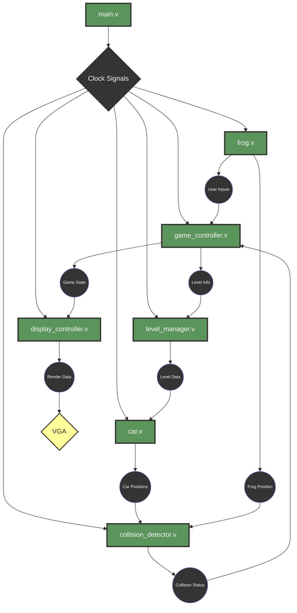

<!-- PROJECT LOGO -->
 

    <h1 align="center"> Technical Specification</h1>
    

        <strong> Frogger in FPGA - Team 5's project</strong>
         

 

<!-- TABLE OF CONTENTS -->

      <h4 style="display: inline-block">Table of Contents</h4>

- [I. Audience](#i-audience)
- [II. Introduction](#ii-introduction)
  - [1. Overview](#1-overview)
  - [2. Context](#2-context)
  - [3. Goals and Objectives](#3-goals-and-objectives)
  - [4. Assumptions](#4-assumptions)
- [III. Hardware](#iii-hardware)
  - [1. Development Board](#1-development-board)
  - [2. Input Controls](#2-input-controls)
  - [3. Light Emitting Diodes (LEDs)](#3-light-emitting-diodes-leds)
  - [4. 7-Segment Display](#4-7-segment-display)
  - [5. VGA Connector](#5-vga-connector)
  - [6. Other Components](#6-other-components)
- [IV. Software Architecture](#iv-software-architecture)
  - [1. Overview of Software Modules](#1-overview-of-software-modules)
  - [2. Module Interactions](#2-module-interactions)
  - [3. Inputs and Outputs Mapping](#3-inputs-and-outputs-mapping)
    - [Input Controls to Game Actions](#input-controls-to-game-actions)
    - [Outputs to Display](#outputs-to-display)
  - [4. Data Structures](#4-data-structures)
  - [5. Memory Management](#5-memory-management)
  - [6. Clock Management](#6-clock-management)
- [V. Functional Requirements](#v-functional-requirements)
  - [1. Game Mechanics](#1-game-mechanics)
  - [2. User Input Handling](#2-user-input-handling)
  - [3. Display Requirements](#3-display-requirements)
  - [4. Game State Management](#4-game-state-management)
  - [5. Scoring System](#5-scoring-system)
  - [6. Level Progression](#6-level-progression)
  - [7. Car Control Behavior](#7-car-control-behavior)
- [VI. Testing and Validation](#vi-testing-and-validation)
  - [1. Test Plan](#1-test-plan)
  - [2. Performance Testing](#2-performance-testing)
  - [3. Validation Criteria](#3-validation-criteria)
  - [4. Error Handling](#4-error-handling)
- [VII. Deployment Plan](#vii-deployment-plan)
  - [1. Rollout Strategy](#1-rollout-strategy)
  - [2. Maintenance Plan](#2-maintenance-plan)
- [VIII. Risks and Mitigation Strategies](#viii-risks-and-mitigation-strategies)
  - [1. Identified Risks](#1-identified-risks)
  - [2. Mitigation Strategies](#2-mitigation-strategies)
- [IX. Work Estimates and Timelines](#ix-work-estimates-and-timelines)
  - [1. Resource Needs](#1-resource-needs)
  - [2. Prioritization](#2-prioritization)
  - [3. Milestones](#3-milestones)
- [X. Glossary](#x-glossary)

---

### I. Audience

<h4>This document is primarily intended for:</h4>
<ul>
    <li><strong>Software Engineer</strong>: To gain insight into both user and technical needs, while assisting in decision-making and strategic planning. Provide clarity on risks, challenges, and the additional technical considerations.</li>
</ul>
<h4>The Secondary Audiences:</h4>
<ul>
    <li><strong>Program Manager</strong>: To ensure coherence with the Functional Specification.</li>
    <li><strong>Quality Assurance</strong>: To support the creation of the Test Plan Document and act as a guide during issue validation.</li>
    <li><strong>Project Manager</strong>: To help identify risks and dependencies at every stage of the project lifecycle.</li>
</ul>

---

### II. Introduction

#### 1. Overview
The project involves the development of a hardware-accelerated version of the Frogger arcade game on an [FPGA](#FPGA) using [Verilog](#Verilog). The game will run on a [VGA](#VGA) display and be controlled through integrated board switches, with a focus on optimizing performance and resource usage on the [FPGA](#FPGA).
#### 2. Context
This project leverages [FPGA](#FPGA) technology to implement the Frogger game in hardware, aiming to exploit the parallelism and real-time capabilities of the platform. The use of [Verilog](#Verilog) allows for direct control of the [FPGA](#FPGA)'s resources, ensuring precise timing and efficient logic design.

#### 3. Goals and Objectives
**Mandatory Requirements**

- FPGA-based Frogger game using Verilog with VGA output.
- VGA output with correct signal synchronization and real-time gameplay.
- Functional input via FPGA switches with reliable debouncing.
- Display a 1x1 frog sprite and at least one car on screen at all times.
- Game logic includes frog movement, car collision detection, and level progression.
- Efficient memory and clock management.

**Nice-to-Have Objectives**
- Detailed, colored frog sprite and up to 16 cars with varying speeds.
- Multiple levels (at least 8) with increasing difficulty.
- Scoring system and enhanced visual feedback via LEDs.
- Performance optimization and scalability for future features.

#### 4. Assumptions

- The development board has sufficient resources to implement the game logic and display requirements.
- The VGA display is compatible with the signal output from the FPGA.
- The input switches on the FPGA board are fully functional and responsive for user control.
- Power supply to the FPGA will be stable and sufficient for the game's hardware demands.
- The project will be developed and tested in an environment with access to necessary edevelopment tools (e.g., Verilog compiler, simulation software).
- No external systems or APIs will be required to complete the project.

---

### III. Hardware

#### 1. Development Board
<table>
  <tr>
      <td><b>Power Requirement</td>
      <td>Operating Voltage:</td>
      <td>Typically 5V supplied via USB.</td>
  </tr>
  <tr>
      <td><b>Environmental Specifications</td>
      <td>Operating Temperature Range:</td>
      <td>0°C to 70°C.</td>
  </tr>
  <tr>
      <td><b>Form Factor</td>
      <td>Dimensions:</td>
      <td>66 mm in width and 48 mm in height</td>
   </tr>
   <tr>
      <td><b>Educational Purpose</td>
      <td colspan="2">Designed for easy experimentation and prototyping without the need for additional breadboards or soldering.</td>
   </tr>
</table>

#### 2. Input Controls
<table>
   <tr>
         <td><b>Number of Switches:</td>
         <td colspan="6">4 (tactile pushbutton swicthes)</td>
   </tr>
   <tr>
         <td rowspan="2"><b>Functionality:</td>
         <td rowspan="2"colspan="2">Allow the User to move the Frog in four direction :</td>
         <td>Switch 1:</td>
         <td>Switch 2:</td>
         <td>Switch 3:</td>
         <td>Switch 4:</td>
   </tr>
   <tr>
         <td>Up</td>
         <td>Left</td>
         <td>Right</td>
         <td>Down</td>
   </tr>

</table>

#### 3. Light Emitting Diodes (LEDs)
<!-- <table>
   <tr>
         <td><b>Number of LEDs :</td>
         <td colspan="3">4</td>
   </tr>
   <tr>
         <td><b>Functionality:</td>
         <td colspan="2">Provides visual feedback for board status and diagnostic information.</td>
      <td colspan="2"><b><i>WHAT THE LED DOING</td>
    </tr>
</table> -->

#### 4. 7-Segment Display
<table>
   <tr>
         <td><b>Number of Displays:</td>
         <td>2</td>
   </tr>
   <tr>
         <td><b>Functionality:</td>
         <td>Displays numeric and alphanumeric information such as the current level of the User's game.</td>
    </tr>
</table>

#### 5. VGA Connector
<table>
   <tr>
         <td><b>VGA Output</td>
         <td>Connector Type:</td>
         <td>15-pin D-sub connector (standard VGA)</td>
   </tr>
   <tr>
         <td><b>Supported Resolutions:</td>
         <td colspan="2"><b>640x480</b>, 800x600, 1024x768, 1280x1024</td>
   </tr>
   <tr>
         <td rowspan="2"><b>Functionality:</td>
         <td colspan="2">Provides video output for displaying game graphics and user interface.</td>
   </tr>
      <tr>
         <td colspan="2">Access to horizontal and vertical sync signals for display timing.</td>
      </tr>
</table>

#### 6. Other Components
<!-- idk for now, maybe even not needed -->
---

### IV. Software Architecture

#### 1. Overview of Software Modules

<table>
      <tr>
            <th><b>Module Name</td>
            <th><b>Description</td>
      </tr>
      <tr>
            <td align="center"><pre><b>main.v</td>
            <td>This is the entry point of the game, responsible for initializing and orchestrating the other modules. It manages the clock signals and ensures proper sequencing of game functions.</td>
      </tr>
      <tr>
            <td align="center"><pre><b>frog.v</td>
            <td>This module handles all the logic related to the frog’s movements on the screen. It manages user inputs to control the frog, ensuring it moves across the lanes while avoiding cars.</td>
      </tr>
      <tr>
            <td align="center"><pre><b>car.v</td>
            <td>Defines the behavior of the cars that the frog must avoid. It manages car speed, direction, and position. Multiple cars can be controlled through this module, with varying speeds across different levels.</td>
      </tr>
      <tr>
            <td align="center"><pre><b>game_controller.v</td>
            <td>Manages the game state, including start, play, game over, and level progression. This module ensures the game follows the intended flow, including tracking the player’s progress and adjusting difficulty.</td>
      </tr>
      <tr>
            <td align="center"><pre><b>display_controller.v</td>
            <td>Responsible for interfacing with the VGA display, controlling what is shown on the screen. It manages the rendering of the frog, cars, game background, and any other visual elements.</td>
      </tr>
      <tr>
            <td align="center"><pre><b>collision_detector.v</td>
            <td>Implements logic to detect when the frog collides with a car. This module ensures accurate hit detection, which is critical for determining when the player loses the game.</td>
      </tr>
      <tr>
            <td align="center"><pre><b>level_manager.v</td>
            <td>Manages the level increments and difficulty scaling. It handles transitions between levels, adjusting car speed and other parameters to make the game more challenging.</td>
      </tr>
</table>

#### 2. Module Interactions

#### 3. Inputs and Outputs Mapping

##### Input Controls to Game Actions

<table>
      <thead>
            <tr>
                  <th ><strong>Input Control</strong></th>
                  <th><strong>Game Action</strong></th>
                  <th><strong>Description</strong></th>
            </tr>
      </thead>
      <tbody>
            <tr>
                  <td align="center">Switch 1</td>
                  <td>Move Frog Up</td>
                  <td>Moves the frog one position up on the screen.</td>
            </tr>
            <tr>
                  <td align="center">Switch 2</td>
                  <td>Move Frog Left</td>
                  <td>Moves the frog one position to the left.</td>
            </tr>
            <tr>
                  <td align="center">Switch 3</td>
                  <td>Move Frog Right</td>
                  <td>Moves the frog one position to the right.</td>
            </tr>
            <tr>
                  <td align="center">Switch 4</td>
                  <td>Move Frog Down</td>
                  <td>Moves the frog one position down on the screen.</td>
            </tr>
            <tr>
                  <td align="center">All the Switch</td>
                  <td>Reset Game</td>
                  <td>Resets the game to the initial state.</td>
      </tbody>
</table>

##### Outputs to Display

<table>
      <thead>
            <tr>
                  <th><strong>Output</strong></th>
                  <th><strong>Display Element</strong></th>
                  <th><strong>Description</strong></th>
            </tr>
      </thead>
            <tr>
                  <td align="center">VGA Output</td>
                  <td>Frog Sprite</td>
                  <td>Displays the frog at its current position.</td>
            </tr>
            <tr>
                  <td align="center">VGA Output</td>
                  <td>Car Sprites</td>
                  <td>Displays cars moving across the screen.</td>
            </tr>
            <tr>
                  <td align="center">VGA Output</td>
                  <td>Background</td>
                  <td>Displays the game background (e.g., road, river).</td>
            </tr>
            <tr>
                  <td align="center">7-Segment Display</td>
                  <td>Current Level</td>
                  <td>Shows the current level of the game.</td>
            </tr>
</table>

#### 4. Data Structures
<table>
      <thead>
            <tr>
                  <th style="width:10%">Category</th>
                  <th>Variable</th>
                  <th>Description</th>
            </tr>
      </thead>
            <tr>
                  <td align="center"><b>Clock</td>
                  <td><code>i_Clk</code></td>
                  <td>System clock input</td>
            </tr>
            <tr>
                  <td rowspan="2" align="center"><b>7-Segment Display</td>
                  <td><code>o_Segment1</code></td>
                  <td>7-segment display output for digit 1</td>
            </tr>
            <tr>
                  <td><code>o_Segment2</code></td>
                  <td>7-segment display output for digit 2</td>
            </tr>
            <tr>
                  <td rowspan="4" align="center"><b>Switches</td>
                  <td><code>i_Switch_1</code></td>
                  <td>Up switch input</td>
            </tr>
            <tr>
                  <td><code>i_Switch_2</code></td>
                  <td>Left switch input</td>
            </tr>
            <tr>
                  <td><code>i_Switch_3</code></td>
                  <td>Right switch input</td>
            </tr>
            <tr>
                  <td><code>i_Switch_4</code></td>
                  <td>Down switch input</td>
            </tr>
            <tr>
                  <td rowspan="5" align="center"><b>VGA Output</td>
                  <td><code>o_VGA_HSync</code></td>
                  <td>VGA horizontal sync output</td>
            </tr>
            <tr>
                  <td><code>o_VGA_VSync</code></td>
                  <td>VGA vertical sync output</td>
            </tr>
            <tr>
                  <td><code>o_VGA_Red</code></td>
                  <td>VGA red component output</td>
            </tr>
            <tr>
                  <td><code>o_VGA_Grn</code></td>
                  <td>VGA green component output</td>
            </tr>
            <tr>
                  <td><code>o_VGA_Blu</code></td>
                  <td>VGA blue component output</td>
            </tr>
</table>

#### 5. Memory Management
<!-- Memory Management
In the Frogger FPGA project, memory is managed by statically allocating resources at compile time, ensuring efficient use of the FPGA's limited internal memory. Key game data such as the frog's position, car positions, and game state are stored in registers, while larger data sets like sprites and the display buffer are managed in Block RAM (BRAM).

To optimize memory:

Registers store small, frequently updated game variables.
BRAM is used for larger assets, such as sprites and background data.
Look-Up Tables (LUTs) store fixed graphics like sprite shapes.
Memory is reused where possible, and double-buffering may be employed to manage display data efficiently and prevent screen flicker.
This approach ensures the game runs smoothly within the FPGA's hardware constraints. SUMMARY AND NEED TO BE REVIEW-->

#### 6. Clock Management

<!-- Clock Management
The Frogger FPGA project relies on precise clock signals to synchronize the game’s operations. A primary clock signal is generated by the FPGA and distributed to all modules, ensuring consistent timing across the system.

Key elements of clock management:

Clock division is used to generate slower clock signals for modules like user input and VGA display.
Game timing is controlled by counting clock cycles, which ensures consistent frog movement, car speed, and level progression.
Frame rate management ensures smooth rendering on the VGA display by synchronizing with the display refresh rate.
This ensures all game elements function in sync, providing responsive gameplay and smooth visual output. SUMMARY AND NEED TO BE REVIEW-->

---

### V. Functional Requirements

#### 1. Game Mechanics

#### 2. User Input Handling

#### 3. Display Requirements

#### 4. Game State Management

#### 5. Scoring System

#### 6. Level Progression

#### 7. Car Control Behavior

---

### VI. Testing and Validation

#### 1. Test Plan

#### 2. Performance Testing

#### 3. Validation Criteria

#### 4. Error Handling

---

### VII. Deployment Plan

#### 1. Rollout Strategy

#### 2. Maintenance Plan

---

### VIII. Risks and Mitigation Strategies

#### 1. Identified Risks  

#### 2. Mitigation Strategies

---

### IX. Work Estimates and Timelines

#### 1. Resource Needs

#### 2. Prioritization

#### 3. Milestones

---

### X. Glossary

|  Terms  |  Definitions  |  Source  |
|:---:|:---|:---:|
|  <a name="FPGA">FPGA</a>  |  Field-Programmable Gate Array, an integrated circuit designed to be configured by a customer or a designer after manufacturing.  |  [Wikipedia](https://en.wikipedia.org/wiki/Field-programmable_gate_array)  |
|  <a name="Verilog">Verilog</a>  |  A hardware description language used to model electronic systems.  |  [Wikipedia](https://en.wikipedia.org/wiki/Verilog)  |
|  <a name="VGA">VGA</a>  |  Video Graphics Array, a display standard for PC computers.  |  [Wikipedia](https://en.wikipedia.org/wiki/Video_Graphics_Array)  |
|  <a name="LED">LED</a>  |  Light-Emitting Diode, a semiconductor light source.  |  [Wikipedia](https://en.wikipedia.org/wiki/Light-emitting_diode)  |
|  <a name="7-Segment-Display">7-Segment Display</a>  |  A form of electronic display device for displaying decimal numerals.  |  [Wikipedia](https://en.wikipedia.org/wiki/Seven-segment_display)  |
|  <a name="Game-State">Game State</a>  |  The current state of the game, including the position of the player, obstacles, and other game elements.  |  [Wikipedia](https://en.wikipedia.org/wiki/Game_state)  |
|  <a name="Scoring-System">Scoring System</a>  |  A mechanism for tracking and rewarding player performance in a game.  |  [Wikipedia](https://en.wikipedia.org/wiki/Scoring_system)  |
|  <a name="Level-Progression">Level Progression</a>  |  The advancement of the player through different stages of the game, typically increasing in difficulty.  |  [Wikipedia](https://en.wikipedia.org/wiki/Level_(video_gaming))  |
|  <a name="Car-Control-Behavior">Car Control Behavior</a>  |  The movement and interaction of cars in the game, including speed, direction, and collision detection.  |  [Wikipedia](https://en.wikipedia.org/wiki/Car_behavior)  |

