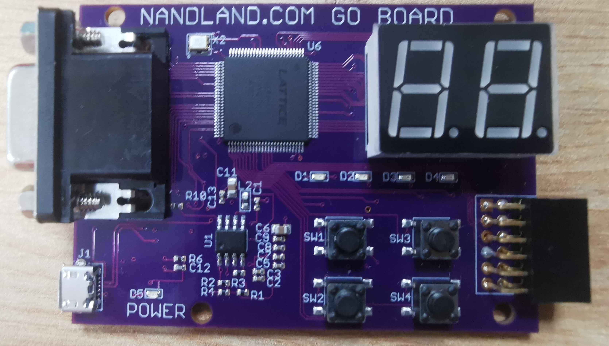
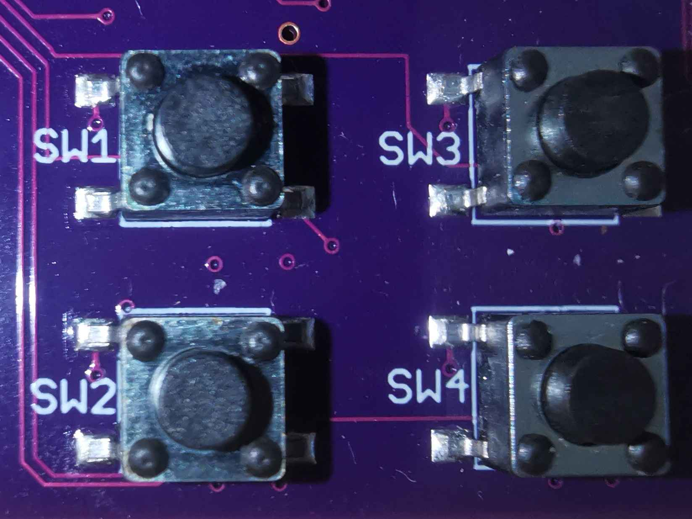
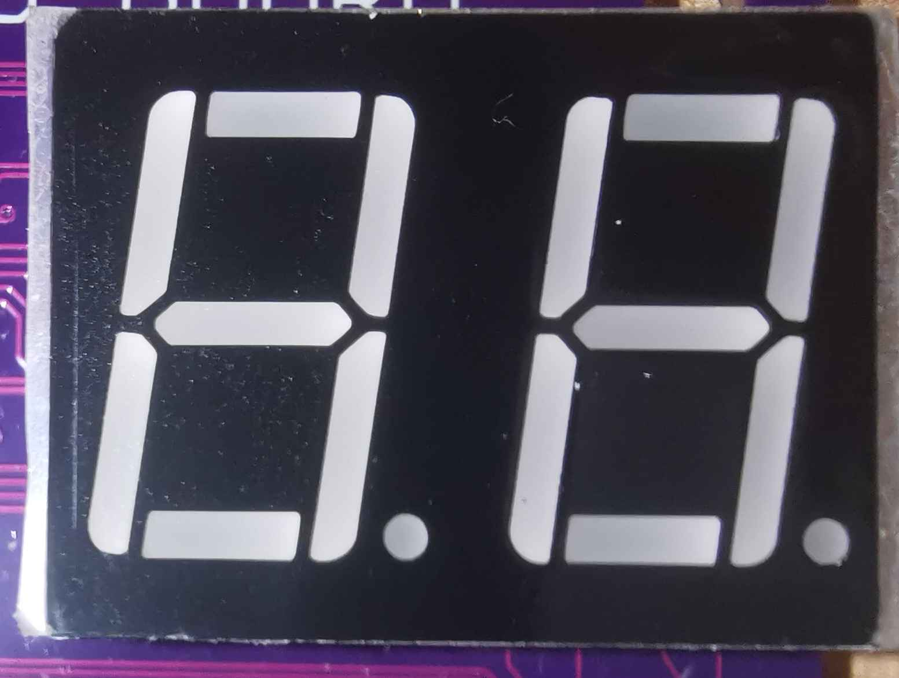
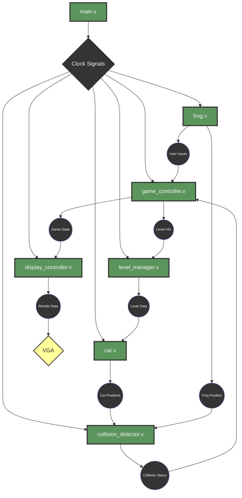

<!-- PROJECT LOGO -->
<br />
<div alig="center">
    <h1 align="center"> Technical Specification</h1>
    <p align="center">
        <strong> Frogger in FPGA - Team 5's project</strong>
        <br />

</div>
</br>

<!-- TABLE OF CONTENTS -->

<details>
<summary>
      <h4 style="display: inline-block">Table of Contents</h4>
</summary>

- [I. Audience](#i-audience)
- [II. Introduction](#ii-introduction)
  - [1. Overview](#1-overview)
  - [2. Context](#2-context)
  - [3. Goals and Objectives](#3-goals-and-objectives)
  - [4. Assumptions](#4-assumptions)
- [III. Hardware](#iii-hardware)
  - [1. Development Board](#1-development-board)
  - [2. Input Controls](#2-input-controls)
  - [3. Light Emitting Diodes (LEDs)](#3-light-emitting-diodes-leds)
  - [4. 7-Segment Display](#4-7-segment-display)
  - [5. VGA Connector](#5-vga-connector)
  - [6. Clock Signal](#6-clock-signal)
- [IV. Software Architecture](#iv-software-architecture)
  - [1. Overview of Software Modules](#1-overview-of-software-modules)
  - [2. Module Interactions](#2-module-interactions)
  - [3. Inputs and Outputs Mapping](#3-inputs-and-outputs-mapping)
    - [Input Controls to Game Actions](#input-controls-to-game-actions)
    - [Outputs to Display](#outputs-to-display)
  - [4. Data Structures](#4-data-structures)
  - [5. Memory Management](#5-memory-management)
  - [6. Clock Management](#6-clock-management)
    - [6.1 Clock Signal Distribution:](#61-clock-signal-distribution)
    - [6.2 Clock Division:](#62-clock-division)
    - [6.3 Game Timing:](#63-game-timing)
    - [6.4 Frame Rate Management:](#64-frame-rate-management)
- [V. Functional Requirements](#v-functional-requirements)
  - [1. Game Mechanics](#1-game-mechanics)
  - [2. User Input Handling](#2-user-input-handling)
  - [3. Display Requirements](#3-display-requirements)
  - [4. Game State Management](#4-game-state-management)
  - [5. Level Progression](#5-level-progression)
  - [6. Car Control Behavior](#6-car-control-behavior)
- [VI. Risks and Mitigation Strategies](#vi-risks-and-mitigation-strategies)
  - [1. Identified Risks](#1-identified-risks)
  - [2. Mitigation Strategies](#2-mitigation-strategies)
- [VII. Glossary](#vii-glossary)

</details>

---

### I. Audience

<h4>This document is primarily intended for:</h4>
<ul>
    <li><strong>Software Engineer</strong>: To gain insight into both user and technical needs, while assisting in decision-making and strategic planning. Provide clarity on risks, challenges, and the additional technical considerations.</li>
</ul>
<h4>The Secondary Audiences:</h4>
<ul>
    <li><strong>Program Manager</strong>: To ensure coherence with the Functional Specification.</li>
    <li><strong>Quality Assurance</strong>: To support the creation of the Test Plan Document and act as a guide during issue validation.</li>
    <li><strong>Project Manager</strong>: To help identify risks and dependencies at every stage of the project lifecycle.</li>
</ul>

---

### II. Introduction

#### 1. Overview
The project involves the development of a hardware-accelerated version of the [Frogger](#Frogger) arcade game on an [FPGA](#FPGA) using [Verilog](#Verilog). The game will run on a [VGA](#VGA) display and be controlled through integrated board switches, with a focus on optimizing performance and resource usage on the FPGA.
#### 2. Context
This project leverages FPGA technology to implement the Frogger game in hardware, aiming to exploit the parallelism and real-time capabilities of the platform. The use of Verilog allows for direct control of the FPGA's resources, ensuring precise timing and efficient logic design.

#### 3. Goals and Objectives
**Mandatory Requirements**

- FPGA-based Frogger game using Verilog with VGA output.
- VGA output with correct signal synchronization and real-time gameplay.
- Functional input via FPGA switches with reliable [debouncing](#debouncing).
- Display a 1x1 frog [sprite](#sprite) and at least one car on screen at all times.
- Game logic includes frog movement, car collision detection, and level progression.
- Efficient memory and clock management.

**Nice-to-Have Objectives**
- Detailed, colored frog sprite and up to 16 cars with varying speeds.
- Multiple levels (at least 8) with increasing difficulty.
- Visual feedback via [7-Segment Displays](#7-Segment-Displays).
- Performance optimization and [maintanibility](#maintanibility) for future features.

#### 4. Assumptions

- The development board has sufficient resources to implement the game logic and display requirements.
- The VGA display is compatible with the signal output from the FPGA.
- The input switches on the FPGA board are fully functional and responsive for user control.
- Power supply to the FPGA will be stable and sufficient for the game's hardware demands.
- No external systems or [APIs](#APIs) will be required to complete the project.

---

### III. Hardware

#### 1. Development Board
<table>
  <tr>
      <td><b>Board Name</b></td>
      <td colspan="2" align="center"><a href="https://nandland.com/the-go-board/">The Go Board</a></td>   </tr>
  <tr>
      <td><b>Power Requirement</td>
      <td>Operating Voltage:</td>
      <td>Typically 5V supplied via USB.</td>
  </tr>
  <tr>
      <td><b>Environmental Specifications</td>
      <td>Operating Temperature Range:</td>
      <td>0°C to 70°C.</td>
  </tr>
  <tr>
      <td><b>Form Factor</td>
      <td>Dimensions:</td>
      <td>66 mm in width and 48 mm in height</td>
   </tr>
   <tr>
      <td><b>Educational Purpose</b></td>
      <td colspan="2">Designed for easy experimentation and prototyping without the need for additional <a href="#breadboards">breadboards</a> or soldering.</td>
   </tr>
</table>



#### 2. Input Controls
<table>
   <tr>
         <td><b>Number of Switches:</td>
         <td colspan="6">4 (tactile pushbutton swicthes)</td>
   </tr>
   <tr>
         <td rowspan="2"><b>Functionality:</td>
         <td rowspan="2"colspan="2">Allow the User to move the Frog in four direction :</td>
         <td>Switch 1:</td>
         <td>Switch 2:</td>
         <td>Switch 3:</td>
         <td>Switch 4:</td>
   </tr>
   <tr>
         <td>Up</td>
         <td>Left</td>
         <td>Right</td>
         <td>Down</td>
   </tr>
</table>



#### 3. Light Emitting Diodes (LEDs)
The code does not contain any references or functionalities related to the use of [LEDs](#LEDs) because we have chosen not to incorporate LED indicators into the game design, focusing instead on other visual outputs such as the VGA display.


#### 4. 7-Segment Display
<table>
   <tr>
         <td><b>Number of Displays:</td>
         <td>2</td>
   </tr>
   <tr>
         <td><b>Functionality:</td>
         <td>Displays numeric and alphanumeric information such as the current level of the User's game.</td>
    </tr>
</table>



#### 5. VGA Connector
<table>
   <tr>
      <td><b>VGA Output</b></td>
      <td>Connector Type:</td>
      <td><a href="#15-pin-d-sub">15-pin D-sub</a> connector (standard VGA)</td>
      </tr>
   <tr>
         <td><b>Supported Resolutions:</td>
         <td colspan="2"><sin>640x480</sin>, 800x600, 1024x768, 1280x1024</td>
   </tr>
   <tr>
         <td rowspan="2"><b>Functionality:</td>
         <td colspan="2">Provides video output for displaying game graphics and user interface.</td>
   </tr>
      <tr>
         <td colspan="2">Access to horizontal and vertical sync signals for display timing.</td>
      </tr>
</table>


#### 6. Clock Signal
<table>
      <tr>
                  <td><b>Frequency:</td>
                  <td>50 MHz</td>
      </tr>
      <tr>
                  <td><b>Functionality:</td>
                  <td colspan="2">Synchronizes game logic, display rendering, and user input processing.</td>
      </tr>
      <tr>
                  <td><b>Clock Division:</b></td>
                  <td colspan="2">Certain modules require slower clock signals to function correctly. <a href="#clock-division">Clock division</a> is used to generate these lower-frequency clocks, ensuring that these modules operate at an appropriate rate. For example, the car movement in the game is controlled using a slower clock to be seen by the human eyes and to make appropriate movements.</td>
      </tr>
</table>

---
### IV. Software Architecture

#### 1. Overview of Software Modules

<table>
      <tr>
            <th><b>Module Name</td>
            <th><b>Description</td>
      </tr>
      <tr>
            <td align="center"><pre><b>main.v</b></pre></td>
            <td>This is the entry point of the game, responsible for initializing and orchestrating the other modules. It manages the <a href="#6-clock-management">clock signals</a> and ensures proper sequencing of game functions.</td>
      </tr>
      <tr>
            <td align="center"><pre><b>frog.v</td>
            <td>This module handles all the logic related to the frog’s movements on the screen. It manages user inputs to control the frog, ensuring it moves across the lanes while avoiding cars.</td>
      </tr>
      <tr>
            <td align="center"><pre><b>car.v</td>
            <td>Defines the behavior of the cars that the frog must avoid. It manages car speed, direction, and position. Multiple cars can be controlled through this module, with varying speeds across different levels.</td>
      </tr>
      <tr>
            <td align="center"><pre><b>game_controller.v</b></pre></td>
            <td>Manages the <a href="#game-state">game state</a>, including start, play, game over, and level progression. This module ensures the game follows the intended flow, including tracking the player’s progress and adjusting difficulty.</td>
      </tr>
      <tr>
            <td align="center"><pre><b>display_controller.v</td>
            <td>Responsible for interfacing with the VGA display, controlling what is shown on the screen. It manages the rendering of the frog, cars, game background, and any other visual elements.</td>
      </tr>
      <tr>
            <td align="center"><pre><b>collision_detector.v</td>
            <td>Implements logic to detect when the frog collides with a car. This module ensures accurate hit detection, which is critical for determining when the player loses the game.</td>
      </tr>
      <tr>
            <td align="center"><pre><b>level_manager.v</td>
            <td>Manages the level increments and difficulty scaling. It handles transitions between levels, adjusting car speed and other parameters to make the game more challenging.</td>
      </tr>
</table>


#### 2. Module Interactions


#### 3. Inputs and Outputs Mapping

##### Input Controls to Game Actions

<table>
      <thead>
            <tr>
                  <th ><strong>Input Control</strong></th>
                  <th><strong>Game Action</strong></th>
                  <th><strong>Description</strong></th>
            </tr>
      </thead>
      <tbody>
            <tr>
                  <td align="center">Switch 1</td>
                  <td>Move Frog Up</td>
                  <td>Moves the frog one position up on the screen.</td>
            </tr>
            <tr>
                  <td align="center">Switch 2</td>
                  <td>Move Frog Left</td>
                  <td>Moves the frog one position to the left.</td>
            </tr>
            <tr>
                  <td align="center">Switch 3</td>
                  <td>Move Frog Right</td>
                  <td>Moves the frog one position to the right.</td>
            </tr>
            <tr>
                  <td align="center">Switch 4</td>
                  <td>Move Frog Down</td>
                  <td>Moves the frog one position down on the screen.</td>
            </tr>
            <tr>
                  <td align="center">All the Switch</td>
                  <td>Reset Game</td>
                  <td>Resets the game to the initial state.</td>
      </tbody>
</table>

##### Outputs to Display

<table>
      <thead>
            <tr>
                  <th><strong>Output</strong></th>
                  <th><strong>Display Element</strong></th>
                  <th><strong>Description</strong></th>
            </tr>
      </thead>
            <tr>
                  <td align="center">VGA Output</td>
                  <td>Frog Sprite</td>
                  <td>Displays the frog at its current position.</td>
            </tr>
            <tr>
                  <td align="center">VGA Output</td>
                  <td>Car Sprites</td>
                  <td>Displays cars moving across the screen.</td>
            </tr>
            <tr>
                  <td align="center">VGA Output</td>
                  <td>Background</td>
                  <td>Displays the game background (e.g., road, river).</td>
            </tr>
            <tr>
                  <td align="center">7-Segment Display</td>
                  <td>Current Level</td>
                  <td>Shows the current level of the game.</td>
            </tr>
</table>

#### 4. Data Structures
<table>
      <thead>
            <tr>
                  <th style="width:10%">Category</th>
                  <th>Variable</th>
                  <th>Description</th>
            </tr>
      </thead>
            <tr>
                  <td align="center"><b>Clock</td>
                  <td><code>i_Clk</code></td>
                  <td>System clock input</td>
            </tr>
            <tr>
                  <td rowspan="2" align="center"><b>7-Segment Display</td>
                  <td><code>o_Segment1</code></td>
                  <td>7-segment display output for digit 1</td>
            </tr>
            <tr>
                  <td><code>o_Segment2</code></td>
                  <td>7-segment display output for digit 2</td>
            </tr>
            <tr>
                  <td rowspan="4" align="center"><b>Switches</td>
                  <td><code>i_Switch_1</code></td>
                  <td>Up switch input</td>
            </tr>
            <tr>
                  <td><code>i_Switch_2</code></td>
                  <td>Left switch input</td>
            </tr>
            <tr>
                  <td><code>i_Switch_3</code></td>
                  <td>Right switch input</td>
            </tr>
            <tr>
                  <td><code>i_Switch_4</code></td>
                  <td>Down switch input</td>
            </tr>
            <tr>
                  <td rowspan="5" align="center"><b>VGA Output</b></td>
                  <td><code>o_VGA_HSync</code></td>
                  <td>VGA <a href="#horizontal-sync">horizontal sync</a> output</td>     </tr>
            <tr>
                  <td><code>o_VGA_VSync</code></td>
                  <td>VGA <a href="#vertical-sync">vertical sync</a> output</td>     </tr>
            <tr>
                  <td><code>o_VGA_Red</code></td>
                  <td>VGA red component output</td>
            </tr>
            <tr>
                  <td><code>o_VGA_Grn</code></td>
                  <td>VGA green component output</td>
            </tr>
            <tr>
                  <td><code>o_VGA_Blu</code></td>
                  <td>VGA blue component output</td>
            </tr>
</table>

#### 5. Memory Management
In the Frogger FPGA project, memory is managed to optimize the limited resources of the FPGA. Key data such as the frog’s position, car positions, and game state are stored in registers for fast access. Larger data sets, like sprite information and display buffers, are stored in Block RAM (BRAM).

Memory optimization strategies include:

- [Registers](#registers) for small, frequently updated variables.
- [BRAM](#BRAM) for larger assets like sprites and backgrounds.
- Look-Up Tables ([LUTs](#LUTs)) to store fixed graphical elements.

---

#### 6. Clock Management

##### 6.1 Clock Signal Distribution:
The primary clock signal (`i_Clk`) is distributed to all modules to maintain synchronization. This ensures that all processes in the system operate in unison. For instance, the `i_Clk` signal drives the VGA controller, sprite renderers, and the game controller module.

>Example:  
>In `src/main.v`, the `i_Clk` signal is connected to the VGA controller and other modules:
>```verilog
>always @(posedge i_Clk) begin
>   // Clock-driven processes
>end
>```
---
##### 6.2 Clock Division: 
Certain modules require slower clock signals to function correctly, such as game elements with slower movement. Clock division is used to generate these lower-frequency clocks, ensuring that these modules operate at an appropriate rate. For example, the car movement in the game is controlled using a slower clock.

>Example:  
>In `src/sprites/car.v`, a clock divider is used to slow down the car’s movement:
>```verilog
>reg [N:0] counter;
>always @(posedge i_Clk) begin
>    if (counter == TARGET) begin
>        // Trigger movement at a slower rate
>        counter <= 0;
>    end else begin
>        counter <= counter + 1;
>    end
>end
>```
---
##### 6.3 Game Timing:
Game timing is managed by counting clock cycles, which ensures smooth gameplay and synchronized events like movement and level progression. By counting the clock pulses, the system can keep track of in-game time intervals, ensuring that actions like jumping, obstacles moving, or time limits are handled consistently.

>Example:  
>In `src/main.v`, clock cycles are counted to implement a timer that controls game events:
>```verilog
>reg [31:0] timer;
>always @(posedge i_Clk) begin
>    timer <= timer + 1;
>    if (timer == TIME_LIMIT) begin
>        // Trigger event (e.g., level progression)
>    end
>end
>```
---
##### 6.4 Frame Rate Management:
Synchronizing the frame rate with the VGA display’s refresh rate ensures that the graphics are updated smoothly, preventing issues like screen tearing. The system is designed to match the frame update frequency with the VGA display's 50Hz refresh rate.

>Example:  
>In the VGA controller within `src/main.v`, frame synchronization ensures smooth rendering:
>```verilog
>always @(posedge i_Clk) begin
>    if (vga_refresh_ready) begin
>        // Update frame data
>    end
>end
>```

---

### V. Functional Requirements

#### 1. Game Mechanics

The core gameplay revolves around guiding a frog safely across a perilous road filled with moving cars, leading to increasingly challenging levels. Key mechanics include:

- **Frog Movement**: The player controls a frog that moves up, down, left, and right across the screen.

> <ins>Example (from player.v):</ins>  
> The player's movement is controlled using switches for up, down, left, and right. The player.v module handles debouncing for smooth input and updates the player's x and y coordinates based on directional inputs:
>
```verilog
always @(posedge i_Clk) begin
    if (w_player_up == 1'b0 && r_player_up == 1'b1) begin
        if (o_player_y > 1) begin
            o_player_y <= o_player_y - 1;
        end
    end else if (w_player_down == 1'b0 && r_player_down == 1'b1) begin
        if (o_player_y < 15) begin
            o_player_y <= o_player_y + 1;
        end
    end
    // Similar logic for left and right...
end
```

---
- **Cars**: Vehicles of varying speeds move horizontally across the screen, posing obstacles for the frog.

> <ins>Example (from car.v):</ins>  
> The car.v module simulates the movement of cars across the screen, resetting their position after they pass the right side of the display:
>
```verilog
always @(posedge i_Clk) begin
    if (clock_tick < 12500000) begin
        clock_tick <= clock_tick + 1;
    end else begin
        clock_tick <= 0;
        if (o_car_x < 20) begin
            o_car_x <= o_car_x + 1;
        end else begin
            o_car_x <= 0;
        end
    end
end
```

---
- **Collision Detection**: If the frog collides with a car, the game ends in a "Game Over" state.

> <ins>Example (from main.v):</ins>  
> Collision detection checks whether the player's position matches that of any car:
>
```verilog
if ((car_x == player_x && car_y == player_y) || (car2_x == player_x && car2_y == player_y)) begin
    o_VGA_Red = 3'b111; o_VGA_Grn = 3'b000; o_VGA_Blu = 3'b111; // Player hit by a car
    i_reset <= 1;
end
```

---
- **Goal**: Each level has a designated goal area that the frog must reach to progress.

> **The goal could be defined in a new module that monitors player position relative to a certain vertical coordinate on the screen; specifics are lacking in current modules.**

---
- **Level Progression**: With each completed level, difficulty ramps up—cars move faster, lanes get narrower, and new obstacles appear.

> <ins>Example (from main.v):</ins>  
> The game keeps track of the current level and increments it when the frog reaches the top of the screen:
>
```verilog
if (player_y == 1) begin
    if (level == 99) begin
        level <= 0;
    end else begin
        level <= level + 1;
    end
end
```

---
- **Visual Feedback**: Clear visual cues for important game states like level transitions and game over.

> <ins>Example (from main.v):</ins>  
> The game manages colors on the VGA output to indicate the player's and cars' positions:
>
```verilog
if (cell_x == player_x && cell_y == player_y) begin
    o_VGA_Red = 3'b000; o_VGA_Grn = 3'b000; o_VGA_Blu = 3'b111; // Player color
end
```

---
- **Reset Function**: A reset option allows players to restart the game at any point. 

> <ins>Example (from player.v):</ins>  
> The player can reset their position when the reset signal is triggered:
>
```verilog
if (i_reset == 1) begin
    o_player_x <= 10;
    o_player_y <= 15;
    o_reset <= 1;
end else begin
    o_reset <= 0;
end
```

---
#### 2. User Input Handling

User input is critical to navigating the game world. The system will respond to:

- **Directional Movement**: The FPGA switches will control the frog’s movements in four directions—up, down, left, and right.

> <ins>Example (from player.v):</ins>  
> The player uses switches for directional control, with debounced inputs processed to ensure accurate movements:
>
```verilog
always @(posedge i_Clk) begin
    r_player_up <= w_player_up;
    r_player_down <= w_player_down;
    // Logic for left and right movements...
    if (w_player_up == 1'b0 && r_player_up == 1'b1) begin
        if (o_player_y > 1) begin
            o_player_y <= o_player_y - 1;
        end
    end
    // Similarly for down, left, and right...
end
```

---
- **Game Reset**: Pressing all switches simultaneously will reset the game, restarting from the beginning.

> <ins>Example (from player.v):</ins>  
> The reset functionality resets the player's position and the game state:
>
```verilog
if (i_reset == 1) begin
    o_player_x <= 10;
    o_player_y <= 15;
    o_reset <= 1;
end
```

---
- **Debounced Inputs**: Debouncing ensures reliable control, preventing unintended multiple actions from a single switch press.

> <ins>Example (from debounce_switch.v):</ins>  
> The debounce logic stabilizes the input switch state before passing it to the player control module:
>
```verilog
always @(posedge i_Clk) begin
    if (i_Switch !== r_State && r_Count < c_DEBOUNCE_LIMIT)
        r_Count <= r_Count + 1;
    // Switch stabilization logic...
end
assign o_Switch = r_State;
```

---

#### 3. Display Requirements

To enhance the gaming experience, the visual display on the VGA screen should include:

- **Frog Sprite**: A clearly defined, smoothly frog that the player controls.

> <ins>Example (from main.v):</ins>  
> The output logic for the player sprite indicates its position:
>
```verilog
if (cell_x == player_x && cell_y == player_y) begin
    // Color the player
    o_VGA_Red = 3'b000; o_VGA_Grn = 3'b000; o_VGA_Blu = 3'b111; // Blue for player
end
```

---
- **Moving Cars**: Vehicles of varying speeds and sizes that traverse the screen, presenting obstacles.

> <ins>Example (from car.v):</ins>  
> The car module controls the horizontal velocity of cars based on a clock:
>
```verilog
if (clock_tick < 12500000) begin
    clock_tick <= clock_tick + 1;
end else begin
    // Logic to reset car position...
end
```

---
- **Background Elements**: A thematic background (road, grass, etc.) that sets the game environment.

> **This would be represented by the graphic outputs from the `road.v` and `grass.v` modules. These modules define how road and grass areas appear and set boundaries for gameplay. However, code for dynamic river features isn't currently defined.** 

---
- **7-Segment Display**: Displays the current level and other important game information.

> <ins>Example (from seven_segments.v):</ins>  
> The 7-segment display updates to show the current level:
>
```verilog
case (counter/10)
    // Cases for display...
endcase
```

---

#### 4. Game State Management

The game will handle multiple states, ensuring smooth transitions and clear objectives at all times:

- **Start Screen**: There won’t be a dedicated start screen as we decide to focus on the main requirement of the game.

---
- **Play State**: The core gameplay where the player controls the frog, attempting to cross the screen without hitting a car.

> **The play state is handled in `main.v` and encompasses the main game loop which constantly monitors player input, updates positions, and manages collision checks.**

---
- **Game Over State**: If a collision occurs, the game ends with a game over screen.

> <ins>Example (from main.v):</ins>  
> Collision detection triggers the game over state:
>
```verilog
if (collision_detected) begin
    // Logic to display game over message and stop the game
end
```

---
- **Level Transitions**: As the player successfully completes levels, difficulty increases, and new obstacles are introduced.

> <ins>Example (from main.v):</ins>  
> The game can increment levels based on player position:
>
```verilog
if (player_y == 1) begin
    // Logic to increment level...
end
```

---

#### 5. Level Progression

Level progression is a key part of keeping players engaged and challenged. The game will feature:

- **Multiple Levels**: Each level ramps up in difficulty, with faster cars, more obstacles, and narrower lanes.

> <ins>Example (from main.v):</ins>  
> Levels are managed using a variable that increments and affects game mechanics:
>
```verilog
if (level_increased) begin
    // Logic to adjust car speeds and obstacles based on new level
end
```

---
- **Level Transitions**: Visual feedback (such as messages) will signal the player’s progression between levels.

> **There is currently no dedicated visual feedback mechanism implemented within the code; this could be added through changes in the VGA color output or visual cues.**

---
- **Level Information**: The 7-segment display will clearly indicate the current level, helping players track their progress.

> <ins>Example (from seven_segments.v):</ins>  
> The display shows level information as part of the score:
>
```verilog
o_Segment1 = level; // Display current level
```

---

#### 6. Car Control Behavior

The cars are more than just obstacles; they introduce variability and challenge. Their behavior includes:

- **Horizontal Movement**: Cars move steadily across the screen from either left to right or right to left.

> <ins>Example (from car.v):</ins>  
> Cars reset their position after traveling a defined distance:
>
```verilog
if (o_car_x < 20) begin
    o_car_x <= o_car_x + 1; // Move car horizontally
end else begin
    o_car_x <= 0; // Reset position
end
```

---
- **Lane Occupancy**: Only one car per lane at any given time, avoiding lane overcrowding.

> **The current car module does not enforce lane limits per module and needs logic to ensure proper lane assignment or extend the number of car instances.**

---
- **Randomized Patterns**: Car speed and position are randomized for each level, adding an element of unpredictability.

> **Currently vehicles are instantiated with specified starting positions. Randomization can improve challenge but is not in the current design. Additional logic must be developed for this.**

---

### VI. Risks and Mitigation Strategies

#### 1. Identified Risks  

- **Hardware Limitations**: The FPGA development board may have finite resources, such as the number of logic cells and RAM available. These limitations could hinder the ability to implement all desired game features, such as advanced graphics or complex gameplay mechanics. For example, if too much logic is required for player controls and graphics, the overall system may become unresponsive.

- **Timing Issues**: Ensuring smooth performance without lag can be particularly challenging due to the strict timing requirements of the VGA output and the handling of user inputs. If the timing of these signals is off, it can lead to visual artifacts or delayed responses, greatly affecting gameplay.

- **Input Debouncing**: The physical switches used for player input can experience bouncing, causing multiple triggers from a single press. If this bouncing is not controlled, the player may experience unintended movements during gameplay. This can lead to frustration and affect the overall gaming experience.

- **Collision Detection Challenges**: Detecting collisions accurately between the frog and the moving cars or other obstacles can be difficult. If this aspect is not well-implemented, players might find themselves colliding inconsistently, which can frustrate players and make the game feel unfair or broken.

- **Integration Issues**: Integrating various modules (e.g., player controls, cars, road layout) may lead to unexpected interactions and bugs. For instance, if the collision detection relies on player position but the position is not calculated correctly due to integration errors, this could lead to game malfunction.

- **Resource Overuse**: Some game features may consume more computational resources than anticipated, resulting in performance drops. For example, if too many simultaneous vehicles are being processed, it may slow down the game due to inadequate computational resources.

---

#### 2. Mitigation Strategies  

- **Resource Management**: Regularly monitor and evaluate resource usage throughout development. This includes profiling your logic and memory consumption to ensure that you stay within the limits of the FPGA. If resource constraints arise, consider simplifying graphics or features. Example: If memory utilization approaches max capacity, implementing sprite sheets for characters could be a solution to lower memory demands.

- **Timing Analysis**: Conduct a thorough examination of the timing requirements and refine your design to ensure smooth performance. This can include calculating the required delays for different signals and ensuring they meet the necessary timing constraints. Utilize tools like Logicly for manual timing checks to verify that your signal outputs are correct.

- **Robust Debouncing Logic**: Develop an effective debouncing mechanism to filter out noise from switch inputs, ensuring that only stable signals are registered for game controls. For example:
  ```verilog
  always @(posedge i_Clk) begin
      if (i_Switch !== r_State) begin
          r_Count <= r_Count + 1; // Increment count for bouncing
      end else if (r_Count > DEBOUNCE_LIMIT) begin
          r_State <= i_Switch; // Update state only on stable signal
          r_Count <= 0; // Reset count
      end
  end
  ```
  
- **Comprehensive Collision Testing**: Create a detailed collision detection algorithm that is tested against various scenarios. Extensive testing will ensure that the game properly detects all collision cases, diminishing player frustration. For example, if a player is at the edge of a car sprite, your algorithm should still recognize their position accurately.

- **Iterative Testing**: Instead of focusing on complex debugging routines in Verilog, we have chosen to streamline our process by utilizing direct monitoring to test the code. This approach allows us to observe the performance and functionality of the game as it runs on the FPGA, enabling quicker validation and troubleshooting without getting bogged down in debug complexities.

- **Module Integration Testing**: Before final implementation, conduct robust tests of how all modules work together. Identify potential conflicts or unexpected behaviors. Creating testbenches for each module will validate interactions and help isolate issues early.

- **Resource Monitoring**: Continuously monitor the FPGA to ensure it is within its resource capacity. If issues are detected, you can identify features that are consuming excess resources and either modify or remove them for optimal performance.

---

### VII. Glossary

|  Terms  |  Definitions  |  Source  |
|:---:|:---|:---:|
|  <a name="Frogger">Frogger</a>  |  A classic arcade game where the player navigates a frog across a busy road and river.  |  [Wikipedia](https://en.wikipedia.org/wiki/Frogger)  |
|  <a name="FPGA">FPGA</a>  |  Field-Programmable Gate Array, an integrated circuit designed to be configured by a customer or a designer after manufacturing.  |  [Wikipedia](https://en.wikipedia.org/wiki/Field-programmable_gate_array)  |
|  <a name="Verilog">Verilog</a>  |  A hardware description language used to model electronic systems.  |  [Wikipedia](https://en.wikipedia.org/wiki/Verilog)  |
|  <a name="VGA">VGA</a>  |  Video Graphics Array, a display standard for PC computers.  |  [Wikipedia](https://en.wikipedia.org/wiki/Video_Graphics_Array)  |
|  <a name="Debouncing">Debouncing</a>  |  The process of removing noise or bounce from a signal, typically used for switch inputs in digital systems.  |  [Wikipedia](https://en.wikipedia.org/wiki/Switch#Contact_bounce)  |
|  <a name="Sprite">Sprite</a>  |  A two-dimensional image or animation that is integrated into a larger scene.  |  [Wikipedia](https://en.wikipedia.org/wiki/Sprite_(computer_graphics))  |
|  <a name="7-Segment-Displays">7-Segment Displays</a>  |  A form of electronic display device for displaying decimal numerals.  |  [Wikipedia](https://en.wikipedia.org/wiki/Seven-segment_display)  |
|  <a name="maintainability">Maintainability</a>  |  The ease with which a software system can be maintained or modified.  |  [Wikipedia](https://en.wikipedia.org/wiki/Maintainability)  |
|  <a name="APIs">APIs</a>  |  Application Programming Interfaces, a set of rules and protocols for building and interacting with software applications.  |  [Wikipedia](https://en.wikipedia.org/wiki/Application_programming_interface)  |
|  <a name="breadboards">breadboards</a>  |  A construction base for prototyping of electronics.  |  [Wikipedia](https://en.wikipedia.org/wiki/Breadboard)  |
|  <a name="LEDs">LEDs</a>  |  Light-Emitting Diode, a semiconductor light source.  |  [Wikipedia](https://en.wikipedia.org/wiki/Light-emitting_diode)  |
|  <a name="15-pin-d-sub">15-pin D-sub</a>  |  A type of electrical connector commonly used for VGA connections.  |  [Wikipedia](https://en.wikipedia.org/wiki/D-subminiature)  |
|  <a name="Clock-division">Clock division</a>  |  A circuit that divides the frequency of an input clock signal to produce a lower-frequency output.  |  [Wikipedia](https://en.wikipedia.org/wiki/Clock_divider)  |
|  <a name="Clock-signal">Clock signal</a>  |  A periodic signal used to synchronize the operation of digital circuits.  |  [Wikipedia](https://en.wikipedia.org/wiki/Clock_signal)  |
|  <a name="Game-State">Game State</a>  |  The current state of the game, including the position of the player, obstacles, and other game elements.  |  [Wikipedia](https://en.wikipedia.org/wiki/Game_state)  |
|  <a name="horizontal-sync">Horizontal Sync</a>  |  A signal used in video systems to coordinate the refresh rate of the display.  |  [Wikipedia](https://en.wikipedia.org/wiki/Horizontal_sync)  |
|  <a name="vertical-sync">Vertical Sync</a>  |  A signal used in video systems to indicate the end of a frame and the beginning of a new one.  |  [Wikipedia](https://en.wikipedia.org/wiki/Vertical_sync)  |
|  <a name="Registers">Registers</a>  |  Small, fast memory elements used to store data within digital circuits.  |  [Wikipedia](https://en.wikipedia.org/wiki/Registers)  |
|  <a name="BRAM">BRAM</a>  |  Block RAM, a type of memory available in FPGAs that can be used for storing data.  |  [Xilinx](https://www.xilinx.com/support/documentation/ip_documentation/blk_mem_gen/v8_4/pg058-blk-mem-gen.pdf)  |
|  <a name="LUTs">LUTs</a>  |  Look-Up Table, a type of memory used in FPGAs to implement logic functions.  |  [Xilinx](https://www.xilinx.com/support/documentation/sw_manuals/xilinx11/cgd.pdf)  |